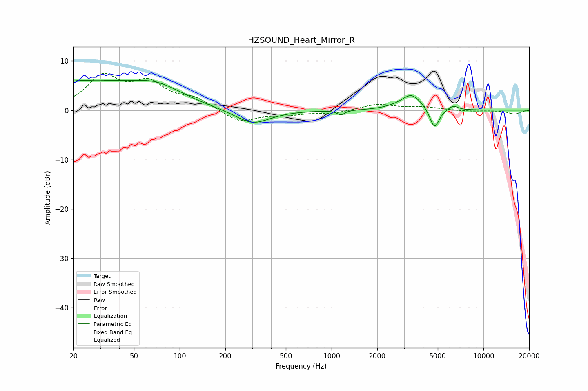

# HZSOUND_Heart_Mirror_R
See [usage instructions](https://github.com/jaakkopasanen/AutoEq#usage) for more options and info.

### Parametric EQs
Apply preamp of -6.2 dB when using parametric equalizer.

|   # | Type    |   Fc (Hz) |    Q |   Gain (dB) |
|-----|---------|-----------|------|-------------|
|   1 | Peaking |        20 | 1.07 |         4.2 |
|   2 | Peaking |        34 | 1.1  |         1.8 |
|   3 | Peaking |        67 | 0.7  |         5.1 |
|   4 | Peaking |       136 | 0.7  |        -0.2 |
|   5 | Peaking |       302 | 1.24 |        -2.9 |
|   6 | Peaking |      1152 | 5.85 |        -0.9 |
|   7 | Peaking |      2502 | 2.21 |         0.1 |
|   8 | Peaking |      3362 | 2.1  |         3.2 |
|   9 | Peaking |      4758 | 4.51 |        -4.3 |
|  10 | Peaking |      6315 | 4.35 |         0.9 |

### Fixed Band EQs
When using fixed band (also called graphic) equalizer, apply preamp of **-7.6 dB** (if available) and set gains manually with these parameters.

|   # | Type    |   Fc (Hz) |    Q |   Gain (dB) |
|-----|---------|-----------|------|-------------|
|   1 | Peaking |        31 | 1.41 |         6.5 |
|   2 | Peaking |        62 | 1.41 |         4.9 |
|   3 | Peaking |       125 | 1.41 |         2.1 |
|   4 | Peaking |       250 | 1.41 |        -2.5 |
|   5 | Peaking |       500 | 1.41 |        -0.8 |
|   6 | Peaking |      1000 | 1.41 |        -0.6 |
|   7 | Peaking |      2000 | 1.41 |         1.2 |
|   8 | Peaking |      4000 | 1.41 |         0.6 |
|   9 | Peaking |      8000 | 1.41 |        -0.2 |
|  10 | Peaking |     16000 | 1.41 |        -0.8 |

### Graphs

