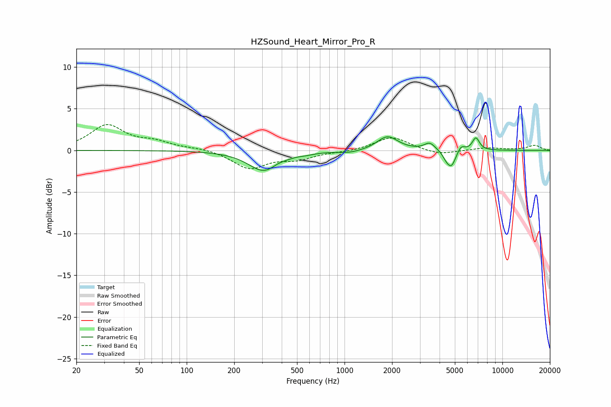

# HZSound_Heart_Mirror_Pro_R
See [usage instructions](https://github.com/jaakkopasanen/AutoEq#usage) for more options and info.

### Parametric EQs
Apply preamp of -1.7 dB when using parametric equalizer.

|   # | Type    |   Fc (Hz) |    Q |   Gain (dB) |
|-----|---------|-----------|------|-------------|
|   1 | Peaking |       308 | 1.45 |        -2.4 |
|   2 | Peaking |       375 | 4.17 |         0.2 |
|   3 | Peaking |       577 | 3.43 |        -0.1 |
|   4 | Peaking |      1088 | 1.91 |        -0.3 |
|   5 | Peaking |      1872 | 2.19 |         1.7 |
|   6 | Peaking |      3465 | 4.16 |         0.9 |
|   7 | Peaking |      4410 | 6    |        -0.6 |
|   8 | Peaking |      4762 | 4.95 |        -1.9 |
|   9 | Peaking |      5464 | 6    |         0.8 |
|  10 | Peaking |      6793 | 6    |         1.5 |

### Fixed Band EQs
When using fixed band (also called graphic) equalizer, apply preamp of **-3.2 dB** (if available) and set gains manually with these parameters.

|   # | Type    |   Fc (Hz) |    Q |   Gain (dB) |
|-----|---------|-----------|------|-------------|
|   1 | Peaking |        31 | 1.41 |         3   |
|   2 | Peaking |        62 | 1.41 |         0.9 |
|   3 | Peaking |       125 | 1.41 |         0.3 |
|   4 | Peaking |       250 | 1.41 |        -2.1 |
|   5 | Peaking |       500 | 1.41 |        -0.9 |
|   6 | Peaking |      1000 | 1.41 |        -0.1 |
|   7 | Peaking |      2000 | 1.41 |         1.7 |
|   8 | Peaking |      4000 | 1.41 |        -0.6 |
|   9 | Peaking |      8000 | 1.41 |         0.3 |
|  10 | Peaking |     16000 | 1.41 |         0.6 |

### Graphs

