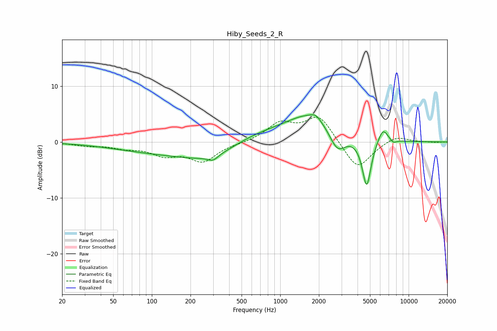

# Hiby_Seeds_2_R
See [usage instructions](https://github.com/jaakkopasanen/AutoEq#usage) for more options and info.

### Parametric EQs
Apply preamp of -5.0 dB when using parametric equalizer.

|   # | Type    |   Fc (Hz) |    Q |   Gain (dB) |
|-----|---------|-----------|------|-------------|
|   1 | Peaking |        95 | 0.44 |        -1.3 |
|   2 | Peaking |       290 | 0.56 |        -2.8 |
|   3 | Peaking |       299 | 3.57 |        -1   |
|   4 | Peaking |       620 | 0.67 |         1.7 |
|   5 | Peaking |      1745 | 0.71 |         5   |
|   6 | Peaking |      1888 | 4    |         0.8 |
|   7 | Peaking |      2785 | 2.15 |        -4.1 |
|   8 | Peaking |      4711 | 4.02 |        -8.7 |
|   9 | Peaking |      6302 | 3.48 |         2.6 |
|  10 | Peaking |      7603 | 5.66 |        -0.6 |

### Fixed Band EQs
When using fixed band (also called graphic) equalizer, apply preamp of **-4.5 dB** (if available) and set gains manually with these parameters.

|   # | Type    |   Fc (Hz) |    Q |   Gain (dB) |
|-----|---------|-----------|------|-------------|
|   1 | Peaking |        31 | 1.41 |        -0.6 |
|   2 | Peaking |        62 | 1.41 |        -0.9 |
|   3 | Peaking |       125 | 1.41 |        -2   |
|   4 | Peaking |       250 | 1.41 |        -3.3 |
|   5 | Peaking |       500 | 1.41 |        -0.2 |
|   6 | Peaking |      1000 | 1.41 |         3.2 |
|   7 | Peaking |      2000 | 1.41 |         4.7 |
|   8 | Peaking |      4000 | 1.41 |        -5.1 |
|   9 | Peaking |      8000 | 1.41 |         1.2 |
|  10 | Peaking |     16000 | 1.41 |        -0.1 |

### Graphs

