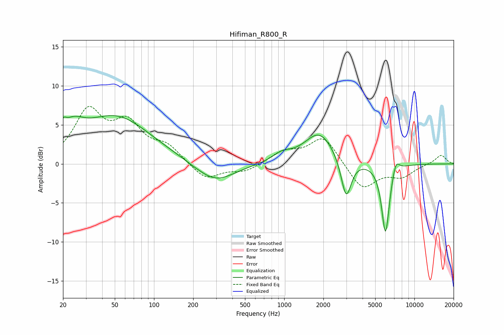

# Hifiman_R800_R
See [usage instructions](https://github.com/jaakkopasanen/AutoEq#usage) for more options and info.

### Parametric EQs
Apply preamp of -6.3 dB when using parametric equalizer.

|   # | Type    |   Fc (Hz) |    Q |   Gain (dB) |
|-----|---------|-----------|------|-------------|
|   1 | Peaking |        20 | 5.93 |         1.4 |
|   2 | Peaking |        24 | 1.68 |         2.5 |
|   3 | Peaking |        51 | 0.53 |         5.9 |
|   4 | Peaking |       198 | 5.87 |        -0   |
|   5 | Peaking |       294 | 0.96 |        -2.5 |
|   6 | Peaking |       960 | 1.97 |         1   |
|   7 | Peaking |      1864 | 1.23 |         4   |
|   8 | Peaking |      2992 | 3.63 |        -5.3 |
|   9 | Peaking |      5998 | 4.56 |        -9   |
|  10 | Peaking |      7212 | 5.1  |         1.7 |

### Fixed Band EQs
When using fixed band (also called graphic) equalizer, apply preamp of **-7.5 dB** (if available) and set gains manually with these parameters.

|   # | Type    |   Fc (Hz) |    Q |   Gain (dB) |
|-----|---------|-----------|------|-------------|
|   1 | Peaking |        31 | 1.41 |         6.4 |
|   2 | Peaking |        62 | 1.41 |         4.5 |
|   3 | Peaking |       125 | 1.41 |         2   |
|   4 | Peaking |       250 | 1.41 |        -2.1 |
|   5 | Peaking |       500 | 1.41 |        -1   |
|   6 | Peaking |      1000 | 1.41 |         1.5 |
|   7 | Peaking |      2000 | 1.41 |         3.5 |
|   8 | Peaking |      4000 | 1.41 |        -3.3 |
|   9 | Peaking |      8000 | 1.41 |        -1.5 |
|  10 | Peaking |     16000 | 1.41 |         1.2 |

### Graphs

