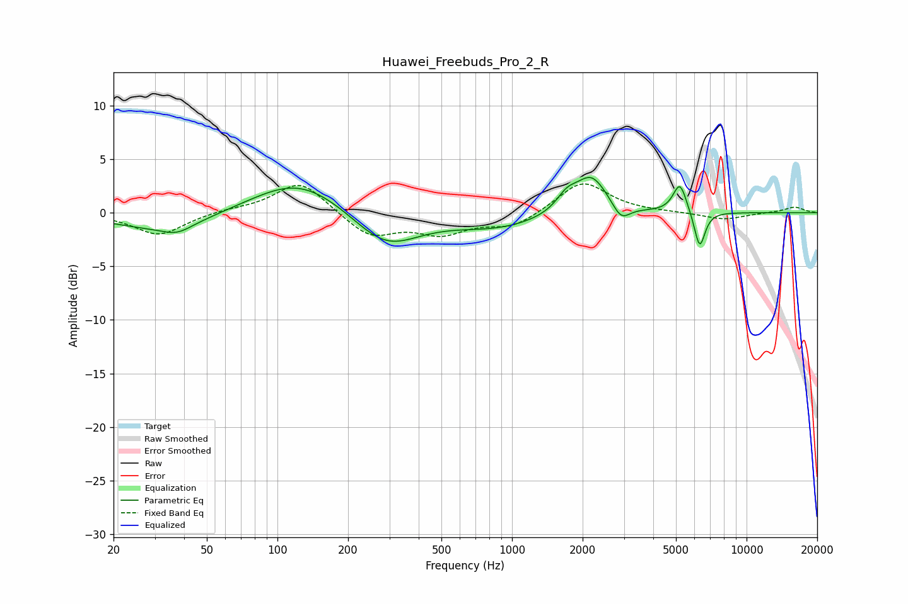

# Huawei_Freebuds_Pro_2_R
See [usage instructions](https://github.com/jaakkopasanen/AutoEq#usage) for more options and info.

### Parametric EQs
Apply preamp of -3.4 dB when using parametric equalizer.

|   # | Type    |   Fc (Hz) |    Q |   Gain (dB) |
|-----|---------|-----------|------|-------------|
|   1 | Peaking |        33 | 0.66 |        -1.6 |
|   2 | Peaking |        37 | 2.27 |        -0.8 |
|   3 | Peaking |       123 | 0.72 |         3.3 |
|   4 | Peaking |       289 | 1    |        -3.4 |
|   5 | Peaking |       870 | 0.73 |        -1.3 |
|   6 | Peaking |      1712 | 3.16 |         1.4 |
|   7 | Peaking |      2181 | 2.06 |         3.5 |
|   8 | Peaking |      2917 | 3.83 |        -1.5 |
|   9 | Peaking |      5195 | 4.84 |         2.8 |
|  10 | Peaking |      6309 | 6    |        -3.5 |

### Fixed Band EQs
When using fixed band (also called graphic) equalizer, apply preamp of **-2.8 dB** (if available) and set gains manually with these parameters.

|   # | Type    |   Fc (Hz) |    Q |   Gain (dB) |
|-----|---------|-----------|------|-------------|
|   1 | Peaking |        31 | 1.41 |        -2.1 |
|   2 | Peaking |        62 | 1.41 |         0.3 |
|   3 | Peaking |       125 | 1.41 |         3   |
|   4 | Peaking |       250 | 1.41 |        -2.2 |
|   5 | Peaking |       500 | 1.41 |        -1.8 |
|   6 | Peaking |      1000 | 1.41 |        -1.3 |
|   7 | Peaking |      2000 | 1.41 |         3   |
|   8 | Peaking |      4000 | 1.41 |         0   |
|   9 | Peaking |      8000 | 1.41 |        -0.7 |
|  10 | Peaking |     16000 | 1.41 |         0.5 |

### Graphs

