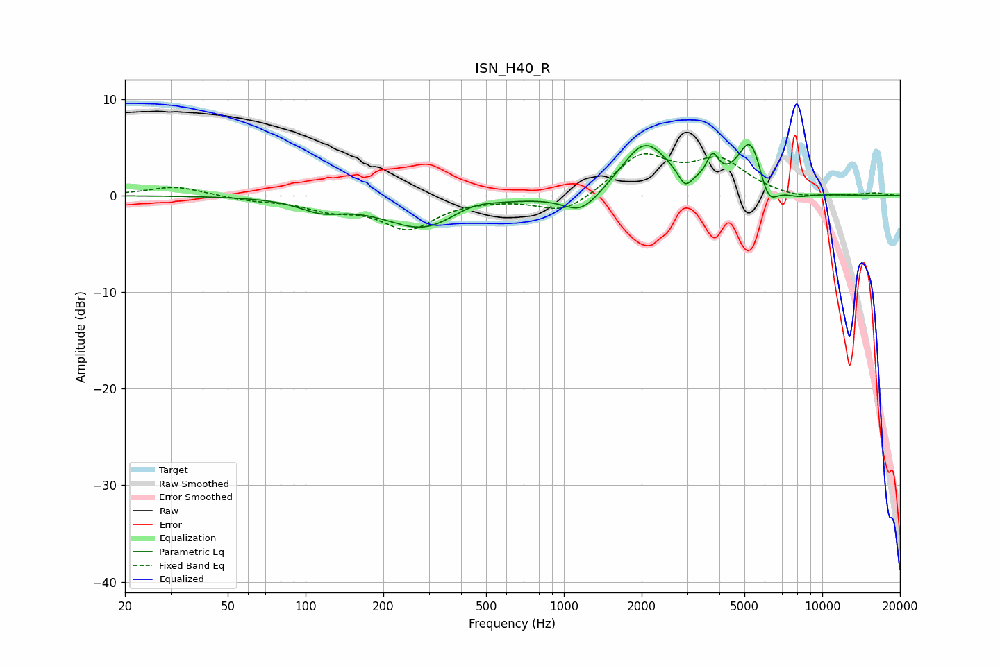

# ISN_H40_R
See [usage instructions](https://github.com/jaakkopasanen/AutoEq#usage) for more options and info.

### Parametric EQs
Apply preamp of -5.4 dB when using parametric equalizer.

|   # | Type    |   Fc (Hz) |    Q |   Gain (dB) |
|-----|---------|-----------|------|-------------|
|   1 | Peaking |       115 | 1.67 |        -1.2 |
|   2 | Peaking |       288 | 0.92 |        -3.5 |
|   3 | Peaking |       438 | 1.6  |         0.9 |
|   4 | Peaking |      1173 | 1.96 |        -2.3 |
|   5 | Peaking |      2063 | 1.53 |         5.5 |
|   6 | Peaking |      2948 | 5.49 |        -1.6 |
|   7 | Peaking |      3767 | 6    |         2.5 |
|   8 | Peaking |      5302 | 2.74 |         6   |
|   9 | Peaking |      6155 | 3.7  |        -3.1 |
|  10 | Peaking |      8053 | 2.52 |        -0.5 |

### Fixed Band EQs
When using fixed band (also called graphic) equalizer, apply preamp of **-4.4 dB** (if available) and set gains manually with these parameters.

|   # | Type    |   Fc (Hz) |    Q |   Gain (dB) |
|-----|---------|-----------|------|-------------|
|   1 | Peaking |        31 | 1.41 |         1   |
|   2 | Peaking |        62 | 1.41 |        -0.4 |
|   3 | Peaking |       125 | 1.41 |        -1.2 |
|   4 | Peaking |       250 | 1.41 |        -3.3 |
|   5 | Peaking |       500 | 1.41 |        -0.2 |
|   6 | Peaking |      1000 | 1.41 |        -1.9 |
|   7 | Peaking |      2000 | 1.41 |         4.1 |
|   8 | Peaking |      4000 | 1.41 |         3.4 |
|   9 | Peaking |      8000 | 1.41 |        -0.5 |
|  10 | Peaking |     16000 | 1.41 |         0.3 |

### Graphs

