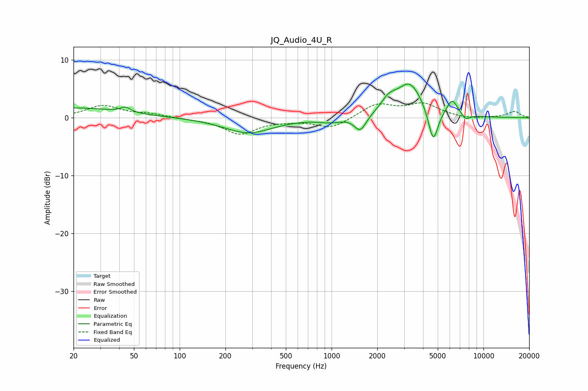

# JQ_Audio_4U_R
See [usage instructions](https://github.com/jaakkopasanen/AutoEq#usage) for more options and info.

### Parametric EQs
Apply preamp of -5.9 dB when using parametric equalizer.

|   # | Type    |   Fc (Hz) |    Q |   Gain (dB) |
|-----|---------|-----------|------|-------------|
|   1 | Peaking |        20 | 0.44 |         1.7 |
|   2 | Peaking |        44 | 4.57 |         0.9 |
|   3 | Peaking |       283 | 0.88 |        -2.6 |
|   4 | Peaking |       984 | 1.89 |        -0.7 |
|   5 | Peaking |      1547 | 3.64 |        -2.7 |
|   6 | Peaking |      2378 | 2.83 |         2   |
|   7 | Peaking |      3267 | 1.65 |         5.9 |
|   8 | Peaking |      4666 | 4.39 |        -6   |
|   9 | Peaking |      6222 | 3.79 |         2.8 |
|  10 | Peaking |      7634 | 4.96 |        -1   |

### Fixed Band EQs
When using fixed band (also called graphic) equalizer, apply preamp of **-2.7 dB** (if available) and set gains manually with these parameters.

|   # | Type    |   Fc (Hz) |    Q |   Gain (dB) |
|-----|---------|-----------|------|-------------|
|   1 | Peaking |        31 | 1.41 |         2   |
|   2 | Peaking |        62 | 1.41 |         0.6 |
|   3 | Peaking |       125 | 1.41 |        -0.2 |
|   4 | Peaking |       250 | 1.41 |        -2.8 |
|   5 | Peaking |       500 | 1.41 |        -0.3 |
|   6 | Peaking |      1000 | 1.41 |        -1.8 |
|   7 | Peaking |      2000 | 1.41 |         2.3 |
|   8 | Peaking |      4000 | 1.41 |         2.3 |
|   9 | Peaking |      8000 | 1.41 |        -0.3 |
|  10 | Peaking |     16000 | 1.41 |         1.1 |

### Graphs

