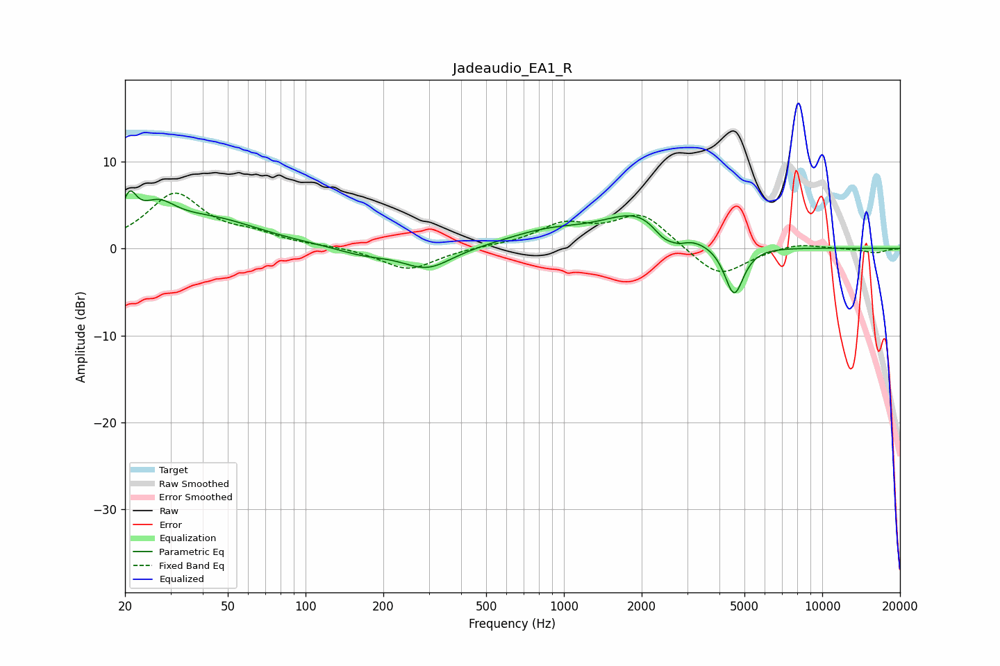

# Jadeaudio_EA1_R
See [usage instructions](https://github.com/jaakkopasanen/AutoEq#usage) for more options and info.

### Parametric EQs
Apply preamp of -6.7 dB when using parametric equalizer.

|   # | Type    |   Fc (Hz) |    Q |   Gain (dB) |
|-----|---------|-----------|------|-------------|
|   1 | Peaking |        21 | 5.03 |         3.7 |
|   2 | Peaking |        27 | 2.03 |         3.1 |
|   3 | Peaking |        43 | 0.72 |         3.1 |
|   4 | Peaking |       167 | 1.4  |        -0.8 |
|   5 | Peaking |       296 | 1.45 |        -2.5 |
|   6 | Peaking |       867 | 0.85 |         1.7 |
|   7 | Peaking |      1984 | 1.03 |         3.9 |
|   8 | Peaking |      2451 | 2.99 |        -1.9 |
|   9 | Peaking |      2798 | 4.68 |        -0.6 |
|  10 | Peaking |      4559 | 3.77 |        -5.8 |

### Fixed Band EQs
When using fixed band (also called graphic) equalizer, apply preamp of **-6.5 dB** (if available) and set gains manually with these parameters.

|   # | Type    |   Fc (Hz) |    Q |   Gain (dB) |
|-----|---------|-----------|------|-------------|
|   1 | Peaking |        31 | 1.41 |         6.1 |
|   2 | Peaking |        62 | 1.41 |         1.2 |
|   3 | Peaking |       125 | 1.41 |         0.2 |
|   4 | Peaking |       250 | 1.41 |        -2.5 |
|   5 | Peaking |       500 | 1.41 |         0.1 |
|   6 | Peaking |      1000 | 1.41 |         2.5 |
|   7 | Peaking |      2000 | 1.41 |         3.9 |
|   8 | Peaking |      4000 | 1.41 |        -3.5 |
|   9 | Peaking |      8000 | 1.41 |         0.7 |
|  10 | Peaking |     16000 | 1.41 |        -0.5 |

### Graphs

