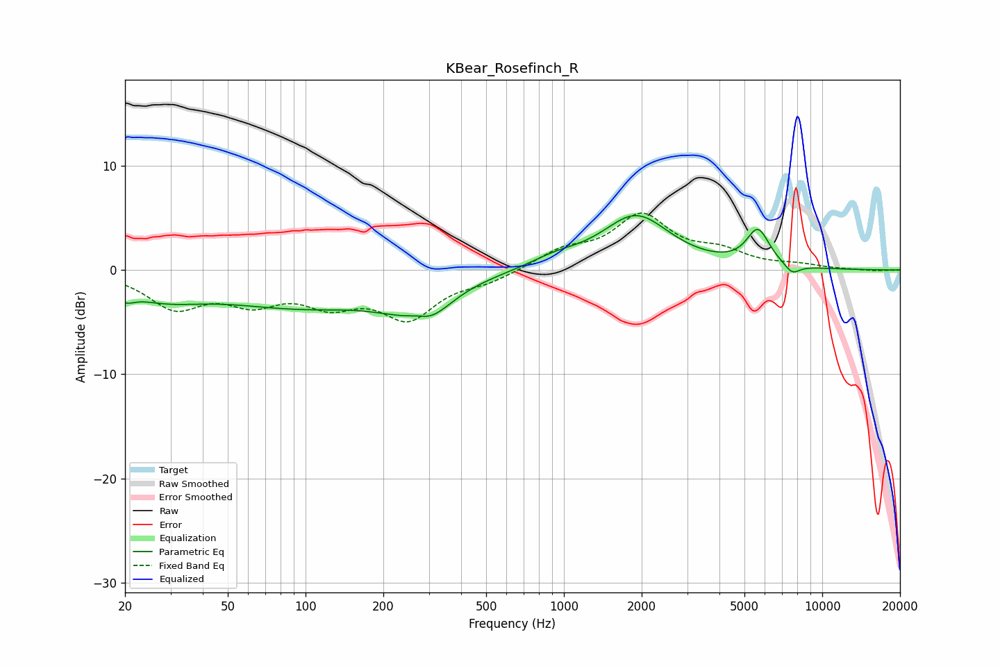

# KBear_Rosefinch_R
See [usage instructions](https://github.com/jaakkopasanen/AutoEq#usage) for more options and info.

### Parametric EQs
Apply preamp of -5.3 dB when using parametric equalizer.

|   # | Type    |   Fc (Hz) |    Q |   Gain (dB) |
|-----|---------|-----------|------|-------------|
|   1 | Peaking |        20 | 3.97 |        -1   |
|   2 | Peaking |        28 | 0.91 |        -1.9 |
|   3 | Peaking |       102 | 0.4  |        -3.4 |
|   4 | Peaking |       193 | 1.93 |        -0.2 |
|   5 | Peaking |       271 | 2.73 |         1.2 |
|   6 | Peaking |       285 | 1.49 |        -3.9 |
|   7 | Peaking |       925 | 1.41 |         0.9 |
|   8 | Peaking |      1900 | 1.08 |         5.1 |
|   9 | Peaking |      5638 | 3.14 |         3.5 |
|  10 | Peaking |      7650 | 4.39 |        -1   |

### Fixed Band EQs
When using fixed band (also called graphic) equalizer, apply preamp of **-5.6 dB** (if available) and set gains manually with these parameters.

|   # | Type    |   Fc (Hz) |    Q |   Gain (dB) |
|-----|---------|-----------|------|-------------|
|   1 | Peaking |        31 | 1.41 |        -3.3 |
|   2 | Peaking |        62 | 1.41 |        -2.6 |
|   3 | Peaking |       125 | 1.41 |        -2.7 |
|   4 | Peaking |       250 | 1.41 |        -4.3 |
|   5 | Peaking |       500 | 1.41 |        -0.9 |
|   6 | Peaking |      1000 | 1.41 |         1.7 |
|   7 | Peaking |      2000 | 1.41 |         5   |
|   8 | Peaking |      4000 | 1.41 |         1.5 |
|   9 | Peaking |      8000 | 1.41 |         0.4 |
|  10 | Peaking |     16000 | 1.41 |        -0.1 |

### Graphs

