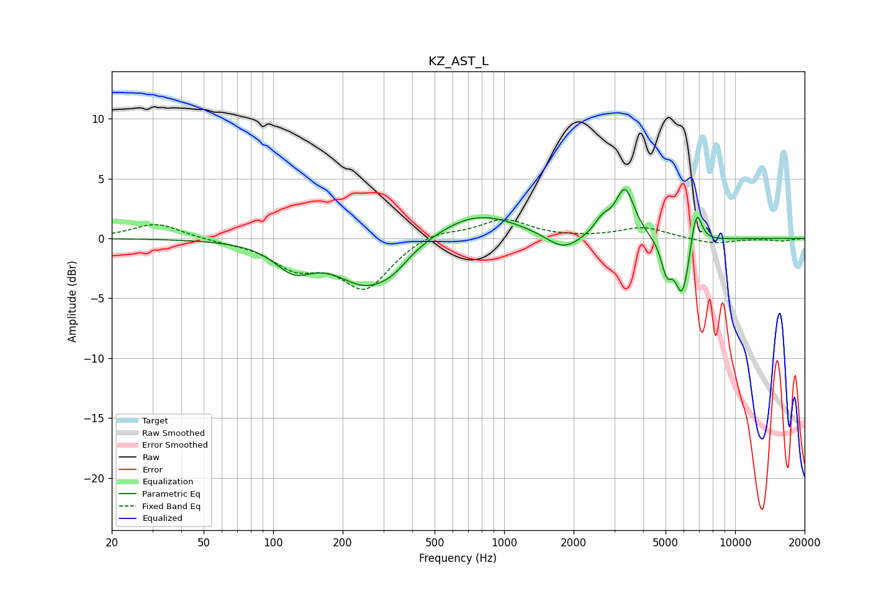

# KZ_AST_L
See [usage instructions](https://github.com/jaakkopasanen/AutoEq#usage) for more options and info.

### Parametric EQs
Apply preamp of -4.2 dB when using parametric equalizer.

|   # | Type    |   Fc (Hz) |    Q |   Gain (dB) |
|-----|---------|-----------|------|-------------|
|   1 | Peaking |       123 | 1.73 |        -2.1 |
|   2 | Peaking |       256 | 1.06 |        -3.8 |
|   3 | Peaking |       333 | 2.32 |        -0.7 |
|   4 | Peaking |       763 | 0.78 |         2.3 |
|   5 | Peaking |      1803 | 1.92 |        -1.4 |
|   6 | Peaking |      2661 | 4.01 |         1.1 |
|   7 | Peaking |      3337 | 3.43 |         4   |
|   8 | Peaking |      5053 | 6    |        -2.4 |
|   9 | Peaking |      5915 | 4.28 |        -4.9 |
|  10 | Peaking |      6787 | 5.63 |         3.4 |

### Fixed Band EQs
When using fixed band (also called graphic) equalizer, apply preamp of **-1.7 dB** (if available) and set gains manually with these parameters.

|   # | Type    |   Fc (Hz) |    Q |   Gain (dB) |
|-----|---------|-----------|------|-------------|
|   1 | Peaking |        31 | 1.41 |         1.3 |
|   2 | Peaking |        62 | 1.41 |        -0.2 |
|   3 | Peaking |       125 | 1.41 |        -2.2 |
|   4 | Peaking |       250 | 1.41 |        -4   |
|   5 | Peaking |       500 | 1.41 |         0.7 |
|   6 | Peaking |      1000 | 1.41 |         1.6 |
|   7 | Peaking |      2000 | 1.41 |        -0   |
|   8 | Peaking |      4000 | 1.41 |         0.9 |
|   9 | Peaking |      8000 | 1.41 |        -0.5 |
|  10 | Peaking |     16000 | 1.41 |        -0.2 |

### Graphs

