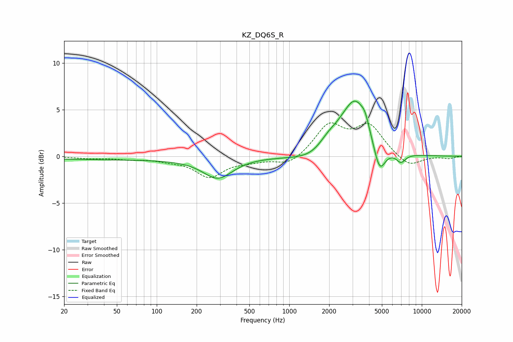

# KZ_DQ6S_R
See [usage instructions](https://github.com/jaakkopasanen/AutoEq#usage) for more options and info.

### Parametric EQs
Apply preamp of -6.0 dB when using parametric equalizer.

|   # | Type    |   Fc (Hz) |    Q |   Gain (dB) |
|-----|---------|-----------|------|-------------|
|   1 | Peaking |        56 | 0.18 |        -0.4 |
|   2 | Peaking |       289 | 1.28 |        -2.2 |
|   3 | Peaking |       919 | 1.29 |        -0.1 |
|   4 | Peaking |      1430 | 1.3  |        -0.6 |
|   5 | Peaking |      1981 | 2.04 |         1   |
|   6 | Peaking |      2501 | 1.98 |         0.5 |
|   7 | Peaking |      3170 | 1.45 |         5.7 |
|   8 | Peaking |      3736 | 5.29 |         0.8 |
|   9 | Peaking |      4795 | 3.14 |        -3.2 |
|  10 | Peaking |      6951 | 3.77 |        -1   |

### Fixed Band EQs
When using fixed band (also called graphic) equalizer, apply preamp of **-3.7 dB** (if available) and set gains manually with these parameters.

|   # | Type    |   Fc (Hz) |    Q |   Gain (dB) |
|-----|---------|-----------|------|-------------|
|   1 | Peaking |        31 | 1.41 |        -0.2 |
|   2 | Peaking |        62 | 1.41 |        -0.3 |
|   3 | Peaking |       125 | 1.41 |        -0.3 |
|   4 | Peaking |       250 | 1.41 |        -2.1 |
|   5 | Peaking |       500 | 1.41 |        -0.4 |
|   6 | Peaking |      1000 | 1.41 |        -1   |
|   7 | Peaking |      2000 | 1.41 |         3.2 |
|   8 | Peaking |      4000 | 1.41 |         3.1 |
|   9 | Peaking |      8000 | 1.41 |        -1.2 |
|  10 | Peaking |     16000 | 1.41 |        -0.2 |

### Graphs

