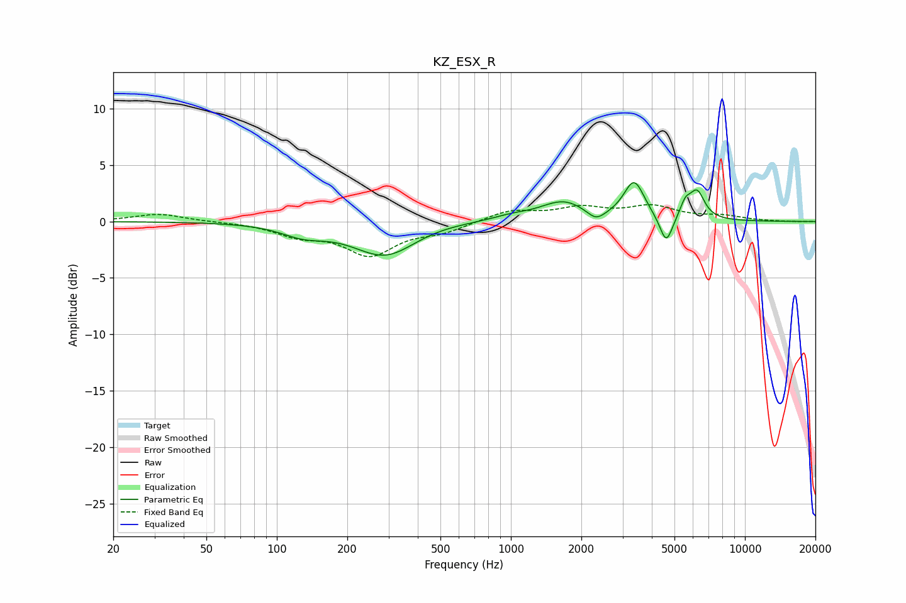

# KZ_ESX_R
See [usage instructions](https://github.com/jaakkopasanen/AutoEq#usage) for more options and info.

### Parametric EQs
Apply preamp of -3.5 dB when using parametric equalizer.

|   # | Type    |   Fc (Hz) |    Q |   Gain (dB) |
|-----|---------|-----------|------|-------------|
|   1 | Peaking |       130 | 1.49 |        -0.9 |
|   2 | Peaking |       293 | 1    |        -3.3 |
|   3 | Peaking |       399 | 0.79 |         0.6 |
|   4 | Peaking |      1005 | 1.68 |         0.4 |
|   5 | Peaking |      1675 | 1.44 |         1.7 |
|   6 | Peaking |      2310 | 3.65 |        -0.9 |
|   7 | Peaking |      3361 | 3.23 |         3.4 |
|   8 | Peaking |      4610 | 5.1  |        -2.6 |
|   9 | Peaking |      5562 | 6    |         1.2 |
|  10 | Peaking |      6243 | 4.28 |         2.4 |

### Fixed Band EQs
When using fixed band (also called graphic) equalizer, apply preamp of **-1.6 dB** (if available) and set gains manually with these parameters.

|   # | Type    |   Fc (Hz) |    Q |   Gain (dB) |
|-----|---------|-----------|------|-------------|
|   1 | Peaking |        31 | 1.41 |         0.7 |
|   2 | Peaking |        62 | 1.41 |        -0   |
|   3 | Peaking |       125 | 1.41 |        -1.1 |
|   4 | Peaking |       250 | 1.41 |        -2.8 |
|   5 | Peaking |       500 | 1.41 |        -0.8 |
|   6 | Peaking |      1000 | 1.41 |         1   |
|   7 | Peaking |      2000 | 1.41 |         1.1 |
|   8 | Peaking |      4000 | 1.41 |         1.2 |
|   9 | Peaking |      8000 | 1.41 |         0.4 |
|  10 | Peaking |     16000 | 1.41 |        -0   |

### Graphs

