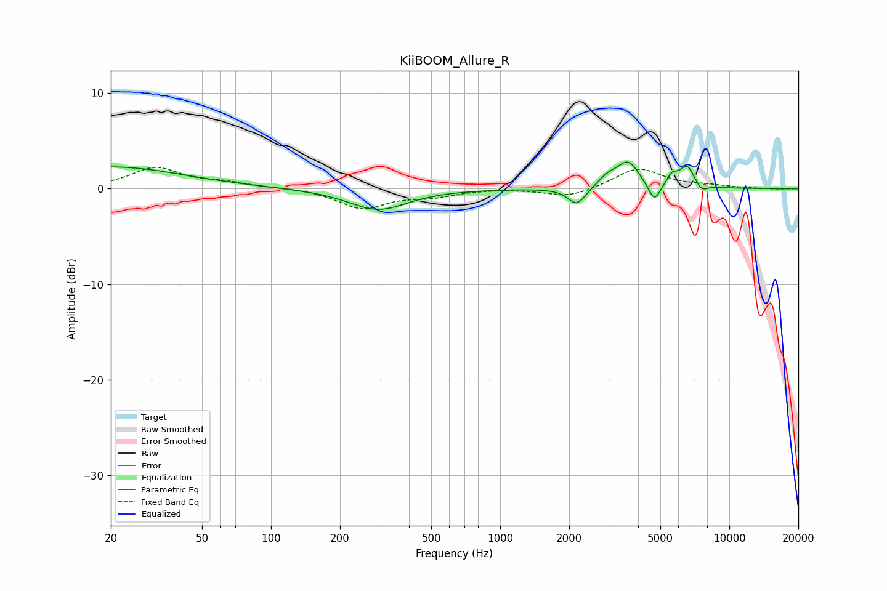

# KiiBOOM_Allure_R
See [usage instructions](https://github.com/jaakkopasanen/AutoEq#usage) for more options and info.

### Parametric EQs
Apply preamp of -2.9 dB when using parametric equalizer.

|   # | Type    |   Fc (Hz) |    Q |   Gain (dB) |
|-----|---------|-----------|------|-------------|
|   1 | Peaking |        20 | 0.46 |         2.3 |
|   2 | Peaking |       293 | 1.1  |        -2.2 |
|   3 | Peaking |      2161 | 3.65 |        -1.8 |
|   4 | Peaking |      2937 | 3.44 |         0.9 |
|   5 | Peaking |      3631 | 2.82 |         2.9 |
|   6 | Peaking |      4012 | 2.43 |        -0.3 |
|   7 | Peaking |      4710 | 5.45 |        -1.9 |
|   8 | Peaking |      5618 | 6    |         1.1 |
|   9 | Peaking |      6535 | 4.17 |         2.2 |
|  10 | Peaking |      7566 | 5.49 |        -0.8 |

### Fixed Band EQs
When using fixed band (also called graphic) equalizer, apply preamp of **-2.3 dB** (if available) and set gains manually with these parameters.

|   # | Type    |   Fc (Hz) |    Q |   Gain (dB) |
|-----|---------|-----------|------|-------------|
|   1 | Peaking |        31 | 1.41 |         2.1 |
|   2 | Peaking |        62 | 1.41 |         0.6 |
|   3 | Peaking |       125 | 1.41 |         0.1 |
|   4 | Peaking |       250 | 1.41 |        -2   |
|   5 | Peaking |       500 | 1.41 |        -0.7 |
|   6 | Peaking |      1000 | 1.41 |         0.1 |
|   7 | Peaking |      2000 | 1.41 |        -0.9 |
|   8 | Peaking |      4000 | 1.41 |         2.2 |
|   9 | Peaking |      8000 | 1.41 |         0.3 |
|  10 | Peaking |     16000 | 1.41 |        -0.1 |

### Graphs

