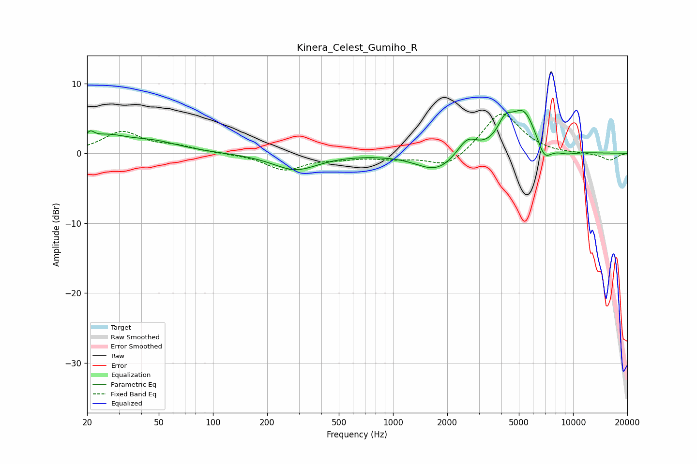

# Kinera_Celest_Gumiho_R
See [usage instructions](https://github.com/jaakkopasanen/AutoEq#usage) for more options and info.

### Parametric EQs
Apply preamp of -6.2 dB when using parametric equalizer.

|   # | Type    |   Fc (Hz) |    Q |   Gain (dB) |
|-----|---------|-----------|------|-------------|
|   1 | Peaking |        21 | 5.95 |         1.3 |
|   2 | Peaking |        25 | 1.27 |         2   |
|   3 | Peaking |        46 | 0.91 |         1.4 |
|   4 | Peaking |       287 | 1.13 |        -2.4 |
|   5 | Peaking |      1746 | 1.28 |        -2.6 |
|   6 | Peaking |      2581 | 2.57 |         2.4 |
|   7 | Peaking |      4194 | 3.34 |         2.8 |
|   8 | Peaking |      5324 | 1.89 |         5.9 |
|   9 | Peaking |      6907 | 3.37 |        -2.6 |
|  10 | Peaking |      9173 | 2.16 |        -0.5 |

### Fixed Band EQs
When using fixed band (also called graphic) equalizer, apply preamp of **-5.7 dB** (if available) and set gains manually with these parameters.

|   # | Type    |   Fc (Hz) |    Q |   Gain (dB) |
|-----|---------|-----------|------|-------------|
|   1 | Peaking |        31 | 1.41 |         3   |
|   2 | Peaking |        62 | 1.41 |         0.9 |
|   3 | Peaking |       125 | 1.41 |        -0   |
|   4 | Peaking |       250 | 1.41 |        -2.3 |
|   5 | Peaking |       500 | 1.41 |        -0.6 |
|   6 | Peaking |      1000 | 1.41 |        -0.6 |
|   7 | Peaking |      2000 | 1.41 |        -2.2 |
|   8 | Peaking |      4000 | 1.41 |         6   |
|   9 | Peaking |      8000 | 1.41 |        -0.1 |
|  10 | Peaking |     16000 | 1.41 |        -1   |

### Graphs

