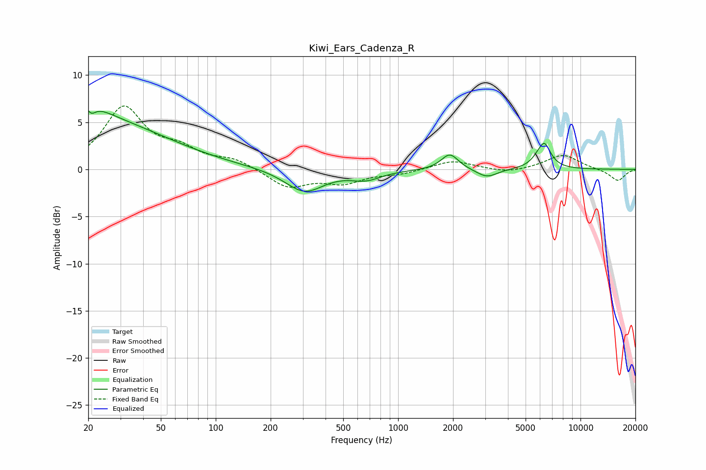

# Kiwi_Ears_Cadenza_R
See [usage instructions](https://github.com/jaakkopasanen/AutoEq#usage) for more options and info.

### Parametric EQs
Apply preamp of -6.3 dB when using parametric equalizer.

|   # | Type    |   Fc (Hz) |    Q |   Gain (dB) |
|-----|---------|-----------|------|-------------|
|   1 | Peaking |        20 | 0.33 |         5.2 |
|   2 | Peaking |        20 | 1.33 |         1.5 |
|   3 | Peaking |        20 | 5.9  |         2.9 |
|   4 | Peaking |        20 | 5.9  |        -3.5 |
|   5 | Peaking |       306 | 1.34 |        -2.4 |
|   6 | Peaking |       667 | 1.69 |        -0.9 |
|   7 | Peaking |      1921 | 3.02 |         1.7 |
|   8 | Peaking |      3071 | 2.49 |        -0.9 |
|   9 | Peaking |      6111 | 5.75 |        -0.9 |
|  10 | Peaking |      6224 | 3.8  |         3.6 |

### Fixed Band EQs
When using fixed band (also called graphic) equalizer, apply preamp of **-6.8 dB** (if available) and set gains manually with these parameters.

|   # | Type    |   Fc (Hz) |    Q |   Gain (dB) |
|-----|---------|-----------|------|-------------|
|   1 | Peaking |        31 | 1.41 |         6.4 |
|   2 | Peaking |        62 | 1.41 |         1.7 |
|   3 | Peaking |       125 | 1.41 |         1   |
|   4 | Peaking |       250 | 1.41 |        -1.9 |
|   5 | Peaking |       500 | 1.41 |        -1.3 |
|   6 | Peaking |      1000 | 1.41 |        -0.4 |
|   7 | Peaking |      2000 | 1.41 |         1   |
|   8 | Peaking |      4000 | 1.41 |        -0.4 |
|   9 | Peaking |      8000 | 1.41 |         1.6 |
|  10 | Peaking |     16000 | 1.41 |        -1.2 |

### Graphs

