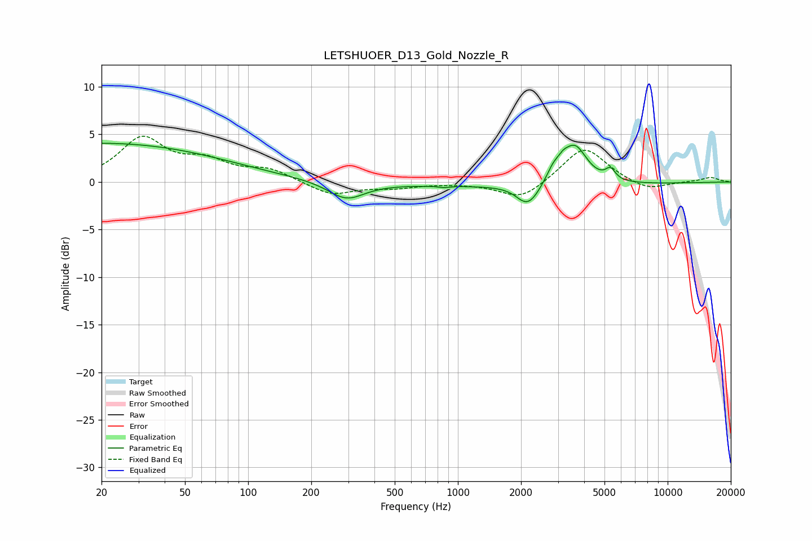

# LETSHUOER_D13_Gold_Nozzle_R
See [usage instructions](https://github.com/jaakkopasanen/AutoEq#usage) for more options and info.

### Parametric EQs
Apply preamp of -4.2 dB when using parametric equalizer.

|   # | Type    |   Fc (Hz) |    Q |   Gain (dB) |
|-----|---------|-----------|------|-------------|
|   1 | Peaking |        20 | 0.23 |         4.1 |
|   2 | Peaking |       294 | 1.64 |        -1.9 |
|   3 | Peaking |       859 | 6    |        -0.1 |
|   4 | Peaking |      1993 | 4.88 |        -0.1 |
|   5 | Peaking |      2100 | 0.21 |        -0.4 |
|   6 | Peaking |      2176 | 2.67 |        -2.2 |
|   7 | Peaking |      2853 | 4.37 |         1.2 |
|   8 | Peaking |      3176 | 5.76 |         0.7 |
|   9 | Peaking |      3607 | 2.39 |         4   |
|  10 | Peaking |      5338 | 6    |         1.1 |

### Fixed Band EQs
When using fixed band (also called graphic) equalizer, apply preamp of **-4.9 dB** (if available) and set gains manually with these parameters.

|   # | Type    |   Fc (Hz) |    Q |   Gain (dB) |
|-----|---------|-----------|------|-------------|
|   1 | Peaking |        31 | 1.41 |         4.4 |
|   2 | Peaking |        62 | 1.41 |         1.9 |
|   3 | Peaking |       125 | 1.41 |         1.2 |
|   4 | Peaking |       250 | 1.41 |        -1.4 |
|   5 | Peaking |       500 | 1.41 |        -0.5 |
|   6 | Peaking |      1000 | 1.41 |        -0.1 |
|   7 | Peaking |      2000 | 1.41 |        -1.9 |
|   8 | Peaking |      4000 | 1.41 |         3.8 |
|   9 | Peaking |      8000 | 1.41 |        -1   |
|  10 | Peaking |     16000 | 1.41 |         0.5 |

### Graphs

