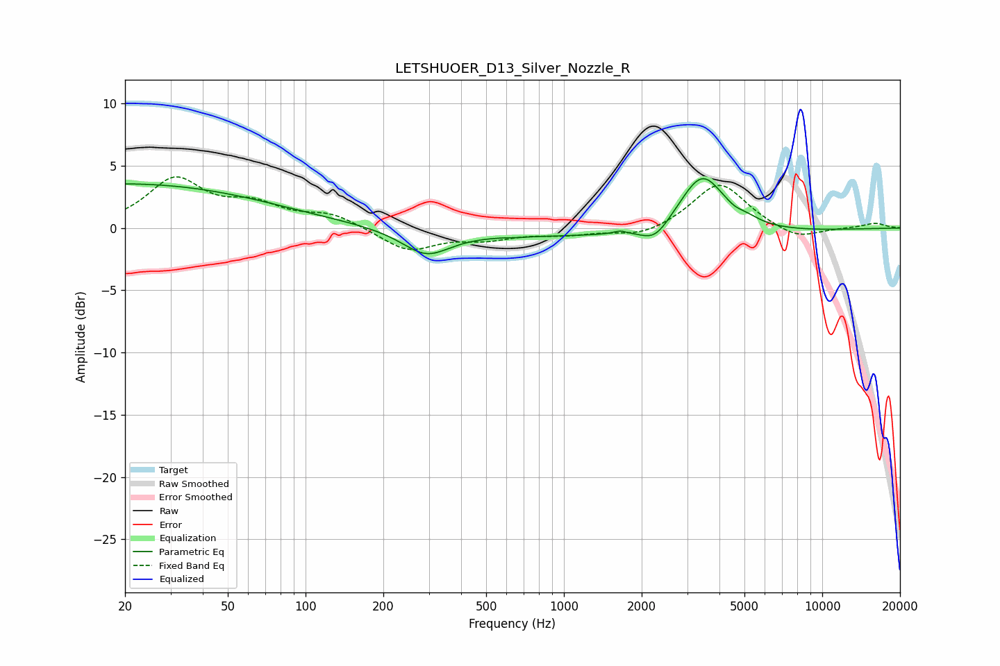

# LETSHUOER_D13_Silver_Nozzle_R
See [usage instructions](https://github.com/jaakkopasanen/AutoEq#usage) for more options and info.

### Parametric EQs
Apply preamp of -4.1 dB when using parametric equalizer.

|   # | Type    |   Fc (Hz) |    Q |   Gain (dB) |
|-----|---------|-----------|------|-------------|
|   1 | Peaking |        20 | 0.25 |         3.5 |
|   2 | Peaking |       293 | 1.52 |        -2   |
|   3 | Peaking |       663 | 5.99 |        -0.1 |
|   4 | Peaking |      1652 | 5.99 |         0.2 |
|   5 | Peaking |      1833 | 0.19 |        -0.7 |
|   6 | Peaking |      2252 | 2.52 |        -1.4 |
|   7 | Peaking |      3443 | 1.58 |         4.9 |
|   8 | Peaking |      3951 | 3.35 |        -0.1 |
|   9 | Peaking |      4561 | 4.69 |        -0.2 |
|  10 | Peaking |      5131 | 2.98 |         0.3 |

### Fixed Band EQs
When using fixed band (also called graphic) equalizer, apply preamp of **-4.2 dB** (if available) and set gains manually with these parameters.

|   # | Type    |   Fc (Hz) |    Q |   Gain (dB) |
|-----|---------|-----------|------|-------------|
|   1 | Peaking |        31 | 1.41 |         3.8 |
|   2 | Peaking |        62 | 1.41 |         1.6 |
|   3 | Peaking |       125 | 1.41 |         1   |
|   4 | Peaking |       250 | 1.41 |        -1.8 |
|   5 | Peaking |       500 | 1.41 |        -0.8 |
|   6 | Peaking |      1000 | 1.41 |        -0.5 |
|   7 | Peaking |      2000 | 1.41 |        -0.8 |
|   8 | Peaking |      4000 | 1.41 |         3.7 |
|   9 | Peaking |      8000 | 1.41 |        -1   |
|  10 | Peaking |     16000 | 1.41 |         0.4 |

### Graphs

