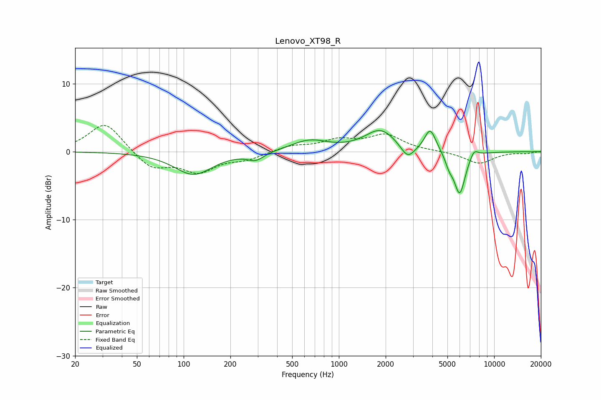

# Lenovo_XT98_R
See [usage instructions](https://github.com/jaakkopasanen/AutoEq#usage) for more options and info.

### Parametric EQs
Apply preamp of -3.2 dB when using parametric equalizer.

|   # | Type    |   Fc (Hz) |    Q |   Gain (dB) |
|-----|---------|-----------|------|-------------|
|   1 | Peaking |       116 | 1.15 |        -3.3 |
|   2 | Peaking |       291 | 2.67 |        -1.1 |
|   3 | Peaking |       646 | 1.21 |         1.6 |
|   4 | Peaking |      1856 | 1.41 |         3.2 |
|   5 | Peaking |      2769 | 3.18 |        -2   |
|   6 | Peaking |      3858 | 4.08 |         2.7 |
|   7 | Peaking |      3997 | 3.04 |         0.7 |
|   8 | Peaking |      5132 | 5.62 |        -1.3 |
|   9 | Peaking |      5996 | 3.7  |        -6.3 |
|  10 | Peaking |      7415 | 4.99 |         1.2 |

### Fixed Band EQs
When using fixed band (also called graphic) equalizer, apply preamp of **-3.9 dB** (if available) and set gains manually with these parameters.

|   # | Type    |   Fc (Hz) |    Q |   Gain (dB) |
|-----|---------|-----------|------|-------------|
|   1 | Peaking |        31 | 1.41 |         4.4 |
|   2 | Peaking |        62 | 1.41 |        -2.5 |
|   3 | Peaking |       125 | 1.41 |        -2.8 |
|   4 | Peaking |       250 | 1.41 |        -1   |
|   5 | Peaking |       500 | 1.41 |         0.8 |
|   6 | Peaking |      1000 | 1.41 |         1.5 |
|   7 | Peaking |      2000 | 1.41 |         2.3 |
|   8 | Peaking |      4000 | 1.41 |         0.1 |
|   9 | Peaking |      8000 | 1.41 |        -1.8 |
|  10 | Peaking |     16000 | 1.41 |        -0.2 |

### Graphs

