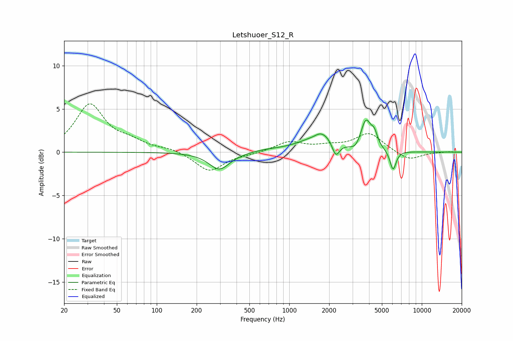

# Letshuoer_S12_R
See [usage instructions](https://github.com/jaakkopasanen/AutoEq#usage) for more options and info.

### Parametric EQs
Apply preamp of -3.8 dB when using parametric equalizer.

|   # | Type    |   Fc (Hz) |    Q |   Gain (dB) |
|-----|---------|-----------|------|-------------|
|   1 | Peaking |       297 | 1.82 |        -2   |
|   2 | Peaking |       657 | 1.63 |         0.2 |
|   3 | Peaking |      1157 | 0.98 |         0.4 |
|   4 | Peaking |      1526 | 3.82 |        -0.2 |
|   5 | Peaking |      1732 | 1.6  |         2.1 |
|   6 | Peaking |      2244 | 5.14 |        -1.7 |
|   7 | Peaking |      3183 | 3.63 |        -0.8 |
|   8 | Peaking |      3785 | 3.53 |         3.5 |
|   9 | Peaking |      4388 | 6    |         1.3 |
|  10 | Peaking |      6068 | 5.99 |        -2.3 |

### Fixed Band EQs
When using fixed band (also called graphic) equalizer, apply preamp of **-5.7 dB** (if available) and set gains manually with these parameters.

|   # | Type    |   Fc (Hz) |    Q |   Gain (dB) |
|-----|---------|-----------|------|-------------|
|   1 | Peaking |        31 | 1.41 |         5.4 |
|   2 | Peaking |        62 | 1.41 |         1   |
|   3 | Peaking |       125 | 1.41 |         0.4 |
|   4 | Peaking |       250 | 1.41 |        -2.2 |
|   5 | Peaking |       500 | 1.41 |        -0.2 |
|   6 | Peaking |      1000 | 1.41 |         1.2 |
|   7 | Peaking |      2000 | 1.41 |         0.5 |
|   8 | Peaking |      4000 | 1.41 |         2.1 |
|   9 | Peaking |      8000 | 1.41 |        -1   |
|  10 | Peaking |     16000 | 1.41 |         0.1 |

### Graphs

