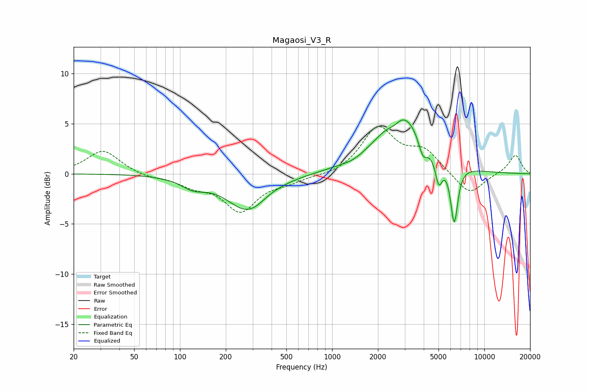

# Magaosi_V3_R
See [usage instructions](https://github.com/jaakkopasanen/AutoEq#usage) for more options and info.

### Parametric EQs
Apply preamp of -5.5 dB when using parametric equalizer.

|   # | Type    |   Fc (Hz) |    Q |   Gain (dB) |
|-----|---------|-----------|------|-------------|
|   1 | Peaking |       122 | 1.75 |        -1   |
|   2 | Peaking |       283 | 1.02 |        -3.8 |
|   3 | Peaking |       382 | 1.44 |         0.4 |
|   4 | Peaking |      1387 | 2    |        -0.3 |
|   5 | Peaking |      2280 | 0.61 |         0.9 |
|   6 | Peaking |      2560 | 3.41 |        -0.8 |
|   7 | Peaking |      2894 | 1.04 |         5.3 |
|   8 | Peaking |      3948 | 4.69 |        -1.9 |
|   9 | Peaking |      5024 | 6    |        -2.6 |
|  10 | Peaking |      6344 | 5.75 |        -5.9 |

### Fixed Band EQs
When using fixed band (also called graphic) equalizer, apply preamp of **-4.8 dB** (if available) and set gains manually with these parameters.

|   # | Type    |   Fc (Hz) |    Q |   Gain (dB) |
|-----|---------|-----------|------|-------------|
|   1 | Peaking |        31 | 1.41 |         2.4 |
|   2 | Peaking |        62 | 1.41 |        -0.4 |
|   3 | Peaking |       125 | 1.41 |        -1   |
|   4 | Peaking |       250 | 1.41 |        -3.6 |
|   5 | Peaking |       500 | 1.41 |        -0.7 |
|   6 | Peaking |      1000 | 1.41 |        -0.3 |
|   7 | Peaking |      2000 | 1.41 |         4.5 |
|   8 | Peaking |      4000 | 1.41 |         2.1 |
|   9 | Peaking |      8000 | 1.41 |        -2.2 |
|  10 | Peaking |     16000 | 1.41 |         1.9 |

### Graphs

