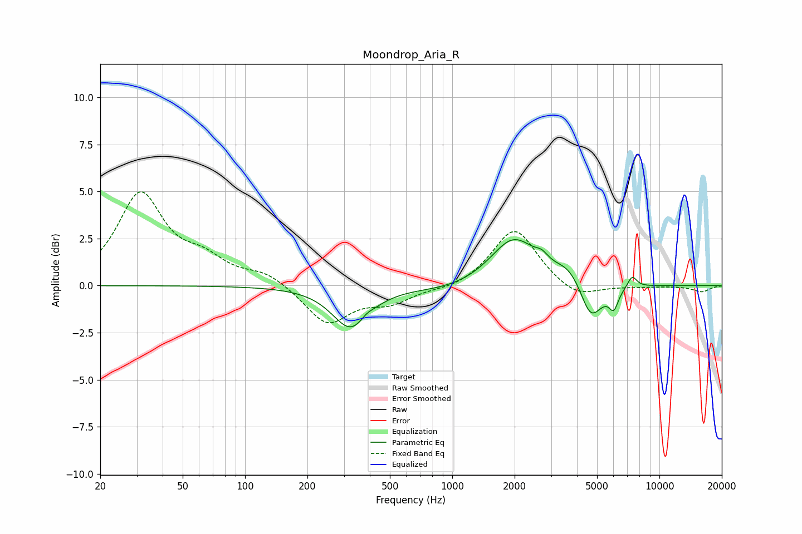

# Moondrop_Aria_R
See [usage instructions](https://github.com/jaakkopasanen/AutoEq#usage) for more options and info.

### Parametric EQs
Apply preamp of -2.5 dB when using parametric equalizer.

|   # | Type    |   Fc (Hz) |    Q |   Gain (dB) |
|-----|---------|-----------|------|-------------|
|   1 | Peaking |       325 | 1.58 |        -2.2 |
|   2 | Peaking |       385 | 4.74 |         0.2 |
|   3 | Peaking |       976 | 0.82 |        -0.3 |
|   4 | Peaking |      1979 | 1.28 |         2.5 |
|   5 | Peaking |      2707 | 4.76 |         0.4 |
|   6 | Peaking |      3667 | 1.99 |         0.8 |
|   7 | Peaking |      4549 | 4.39 |        -0.3 |
|   8 | Peaking |      4714 | 2.45 |        -1.8 |
|   9 | Peaking |      6020 | 6    |        -1   |
|  10 | Peaking |      7387 | 6    |         0.6 |

### Fixed Band EQs
When using fixed band (also called graphic) equalizer, apply preamp of **-5.1 dB** (if available) and set gains manually with these parameters.

|   # | Type    |   Fc (Hz) |    Q |   Gain (dB) |
|-----|---------|-----------|------|-------------|
|   1 | Peaking |        31 | 1.41 |         4.8 |
|   2 | Peaking |        62 | 1.41 |         1.1 |
|   3 | Peaking |       125 | 1.41 |         0.6 |
|   4 | Peaking |       250 | 1.41 |        -2   |
|   5 | Peaking |       500 | 1.41 |        -0.8 |
|   6 | Peaking |      1000 | 1.41 |        -0.2 |
|   7 | Peaking |      2000 | 1.41 |         3.1 |
|   8 | Peaking |      4000 | 1.41 |        -0.8 |
|   9 | Peaking |      8000 | 1.41 |        -0.1 |
|  10 | Peaking |     16000 | 1.41 |        -0.3 |

### Graphs

