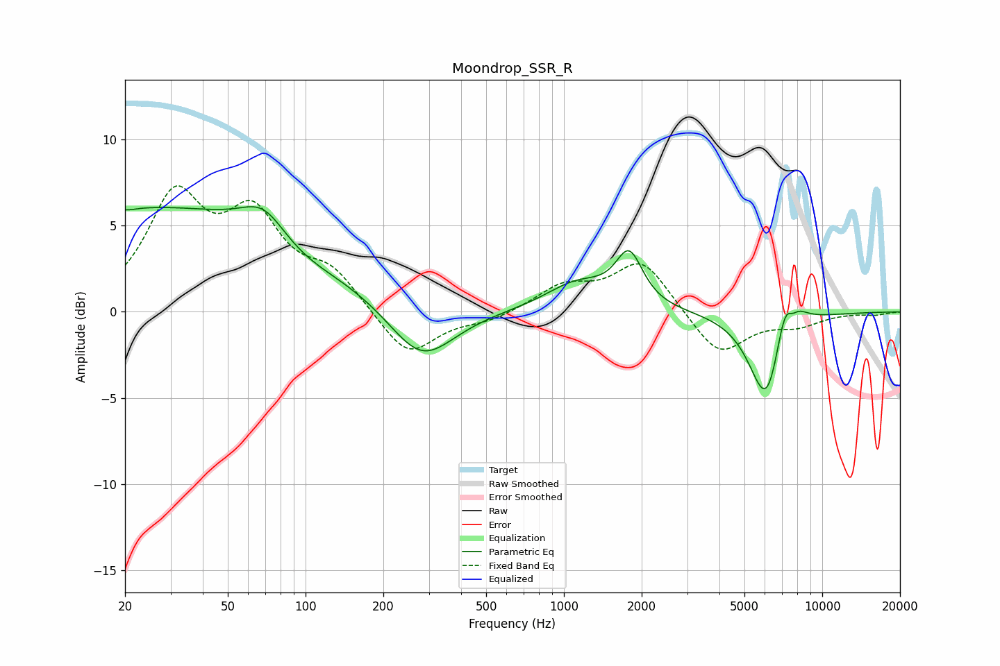

# Moondrop_SSR_R
See [usage instructions](https://github.com/jaakkopasanen/AutoEq#usage) for more options and info.

### Parametric EQs
Apply preamp of -6.2 dB when using parametric equalizer.

|   # | Type    |   Fc (Hz) |    Q |   Gain (dB) |
|-----|---------|-----------|------|-------------|
|   1 | Peaking |        21 | 5.87 |        -0.1 |
|   2 | Peaking |        26 | 0.2  |         6.1 |
|   3 | Peaking |        69 | 1.6  |         2   |
|   4 | Peaking |        91 | 0.89 |        -1.1 |
|   5 | Peaking |       281 | 1.1  |        -3.3 |
|   6 | Peaking |      1126 | 1.15 |         1.6 |
|   7 | Peaking |      1790 | 2.72 |         3   |
|   8 | Peaking |      6147 | 2.04 |        -6.1 |
|   9 | Peaking |      7316 | 2.8  |         4.5 |
|  10 | Peaking |      7606 | 5.14 |        -1.3 |

### Fixed Band EQs
When using fixed band (also called graphic) equalizer, apply preamp of **-7.4 dB** (if available) and set gains manually with these parameters.

|   # | Type    |   Fc (Hz) |    Q |   Gain (dB) |
|-----|---------|-----------|------|-------------|
|   1 | Peaking |        31 | 1.41 |         6.3 |
|   2 | Peaking |        62 | 1.41 |         4.9 |
|   3 | Peaking |       125 | 1.41 |         2   |
|   4 | Peaking |       250 | 1.41 |        -2.7 |
|   5 | Peaking |       500 | 1.41 |        -0.5 |
|   6 | Peaking |      1000 | 1.41 |         1.4 |
|   7 | Peaking |      2000 | 1.41 |         3   |
|   8 | Peaking |      4000 | 1.41 |        -2.6 |
|   9 | Peaking |      8000 | 1.41 |        -0.7 |
|  10 | Peaking |     16000 | 1.41 |        -0.2 |

### Graphs

