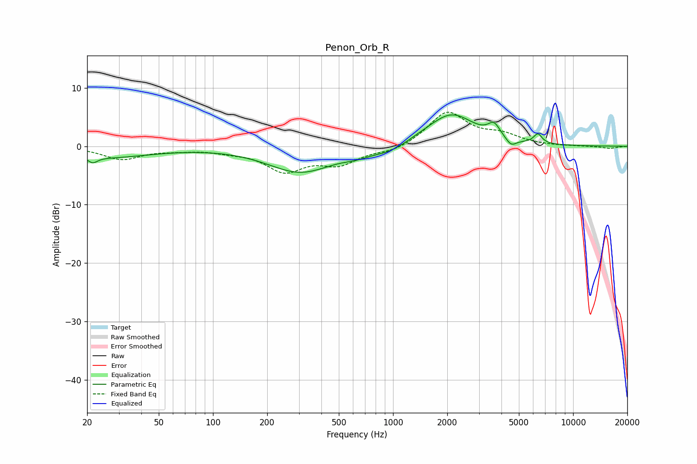

# Penon_Orb_R
See [usage instructions](https://github.com/jaakkopasanen/AutoEq#usage) for more options and info.

### Parametric EQs
Apply preamp of -5.5 dB when using parametric equalizer.

|   # | Type    |   Fc (Hz) |    Q |   Gain (dB) |
|-----|---------|-----------|------|-------------|
|   1 | Peaking |        22 | 5.63 |        -1   |
|   2 | Peaking |        25 | 0.54 |        -1.9 |
|   3 | Peaking |       306 | 0.78 |        -4.4 |
|   4 | Peaking |       622 | 2.1  |        -0.6 |
|   5 | Peaking |       967 | 1.3  |        -1.3 |
|   6 | Peaking |      1421 | 1.2  |         0.6 |
|   7 | Peaking |      2123 | 1.1  |         5.4 |
|   8 | Peaking |      3640 | 4.22 |         2.2 |
|   9 | Peaking |      4526 | 4.92 |        -1.3 |
|  10 | Peaking |      6370 | 6    |         1.7 |

### Fixed Band EQs
When using fixed band (also called graphic) equalizer, apply preamp of **-5.9 dB** (if available) and set gains manually with these parameters.

|   # | Type    |   Fc (Hz) |    Q |   Gain (dB) |
|-----|---------|-----------|------|-------------|
|   1 | Peaking |        31 | 1.41 |        -2.2 |
|   2 | Peaking |        62 | 1.41 |        -0.5 |
|   3 | Peaking |       125 | 1.41 |        -0.6 |
|   4 | Peaking |       250 | 1.41 |        -4   |
|   5 | Peaking |       500 | 1.41 |        -2.8 |
|   6 | Peaking |      1000 | 1.41 |        -1   |
|   7 | Peaking |      2000 | 1.41 |         5.8 |
|   8 | Peaking |      4000 | 1.41 |         1.7 |
|   9 | Peaking |      8000 | 1.41 |        -0   |
|  10 | Peaking |     16000 | 1.41 |        -0.4 |

### Graphs

