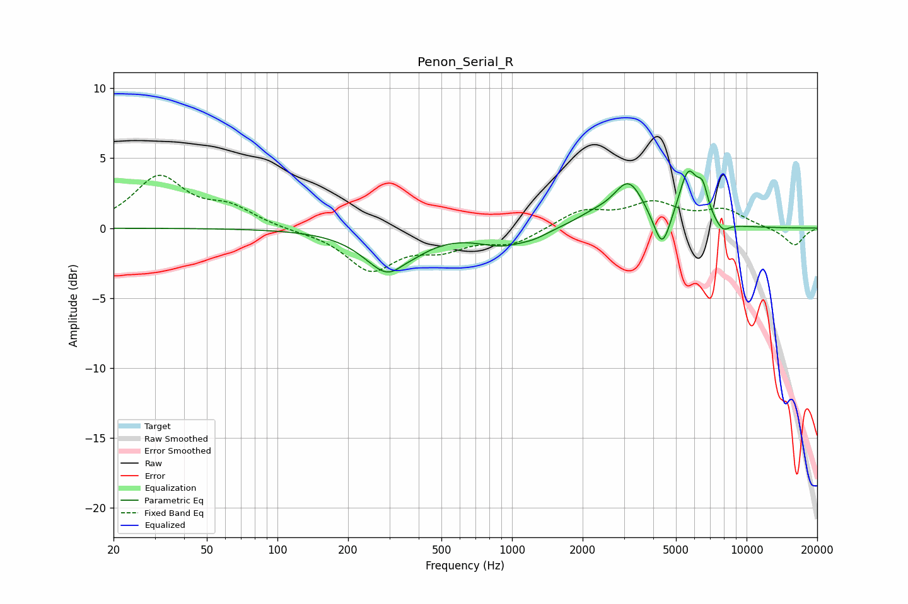

# Penon_Serial_R
See [usage instructions](https://github.com/jaakkopasanen/AutoEq#usage) for more options and info.

### Parametric EQs
Apply preamp of -4.2 dB when using parametric equalizer.

|   # | Type    |   Fc (Hz) |    Q |   Gain (dB) |
|-----|---------|-----------|------|-------------|
|   1 | Peaking |       303 | 1.37 |        -3.3 |
|   2 | Peaking |       341 | 3.2  |         0.4 |
|   3 | Peaking |       911 | 1.35 |        -1.1 |
|   4 | Peaking |      1247 | 2.34 |        -0.3 |
|   5 | Peaking |      2218 | 1.63 |         0.7 |
|   6 | Peaking |      3147 | 2.15 |         3.1 |
|   7 | Peaking |      4365 | 4.03 |        -2.7 |
|   8 | Peaking |      5642 | 3.36 |         3.8 |
|   9 | Peaking |      6504 | 6    |         1.8 |
|  10 | Peaking |      7888 | 4.4  |        -0.7 |

### Fixed Band EQs
When using fixed band (also called graphic) equalizer, apply preamp of **-3.9 dB** (if available) and set gains manually with these parameters.

|   # | Type    |   Fc (Hz) |    Q |   Gain (dB) |
|-----|---------|-----------|------|-------------|
|   1 | Peaking |        31 | 1.41 |         3.6 |
|   2 | Peaking |        62 | 1.41 |         1.3 |
|   3 | Peaking |       125 | 1.41 |        -0.1 |
|   4 | Peaking |       250 | 1.41 |        -2.9 |
|   5 | Peaking |       500 | 1.41 |        -1.2 |
|   6 | Peaking |      1000 | 1.41 |        -1.1 |
|   7 | Peaking |      2000 | 1.41 |         1.2 |
|   8 | Peaking |      4000 | 1.41 |         1.6 |
|   9 | Peaking |      8000 | 1.41 |         1.2 |
|  10 | Peaking |     16000 | 1.41 |        -1.3 |

### Graphs

