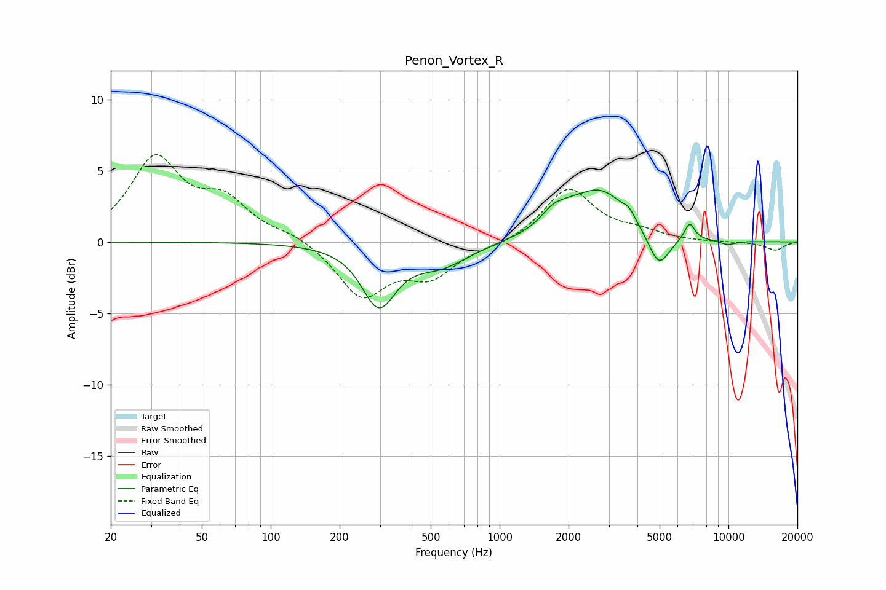

# Penon_Vortex_R
See [usage instructions](https://github.com/jaakkopasanen/AutoEq#usage) for more options and info.

### Parametric EQs
Apply preamp of -3.7 dB when using parametric equalizer.

|   # | Type    |   Fc (Hz) |    Q |   Gain (dB) |
|-----|---------|-----------|------|-------------|
|   1 | Peaking |       297 | 1.98 |        -4.4 |
|   2 | Peaking |       303 | 3.89 |         0.2 |
|   3 | Peaking |       555 | 1.14 |        -1.5 |
|   4 | Peaking |      1719 | 2.54 |         1.1 |
|   5 | Peaking |      2037 | 3.54 |         0.2 |
|   6 | Peaking |      2729 | 1.09 |         3.6 |
|   7 | Peaking |      3676 | 6    |         0.5 |
|   8 | Peaking |      4958 | 2.88 |        -2.5 |
|   9 | Peaking |      6767 | 6    |         1.2 |
|  10 | Peaking |      9906 | 3.15 |        -0.3 |

### Fixed Band EQs
When using fixed band (also called graphic) equalizer, apply preamp of **-6.2 dB** (if available) and set gains manually with these parameters.

|   # | Type    |   Fc (Hz) |    Q |   Gain (dB) |
|-----|---------|-----------|------|-------------|
|   1 | Peaking |        31 | 1.41 |         5.7 |
|   2 | Peaking |        62 | 1.41 |         2.6 |
|   3 | Peaking |       125 | 1.41 |         0.5 |
|   4 | Peaking |       250 | 1.41 |        -3.7 |
|   5 | Peaking |       500 | 1.41 |        -2.2 |
|   6 | Peaking |      1000 | 1.41 |        -0.2 |
|   7 | Peaking |      2000 | 1.41 |         3.7 |
|   8 | Peaking |      4000 | 1.41 |         0.6 |
|   9 | Peaking |      8000 | 1.41 |        -0   |
|  10 | Peaking |     16000 | 1.41 |        -0.6 |

### Graphs

