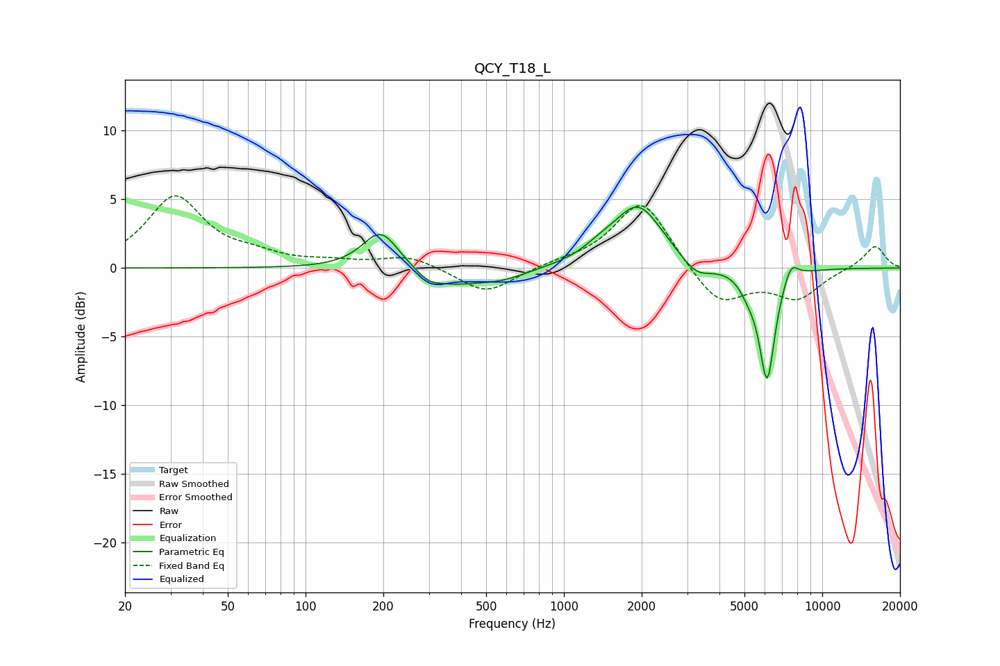

# QCY_T18_L
See [usage instructions](https://github.com/jaakkopasanen/AutoEq#usage) for more options and info.

### Parametric EQs
Apply preamp of -4.5 dB when using parametric equalizer.

|   # | Type    |   Fc (Hz) |    Q |   Gain (dB) |
|-----|---------|-----------|------|-------------|
|   1 | Peaking |       196 | 2.01 |         2.9 |
|   2 | Peaking |       298 | 3.41 |        -0.5 |
|   3 | Peaking |       360 | 1.12 |        -1.2 |
|   4 | Peaking |       582 | 1.41 |        -0.7 |
|   5 | Peaking |      1370 | 2.32 |         0.6 |
|   6 | Peaking |      1935 | 1.48 |         4.5 |
|   7 | Peaking |      3259 | 2.43 |        -1.2 |
|   8 | Peaking |      5191 | 3.96 |        -1   |
|   9 | Peaking |      6118 | 4.49 |        -8   |
|  10 | Peaking |      7575 | 4.95 |         1.3 |

### Fixed Band EQs
When using fixed band (also called graphic) equalizer, apply preamp of **-5.4 dB** (if available) and set gains manually with these parameters.

|   # | Type    |   Fc (Hz) |    Q |   Gain (dB) |
|-----|---------|-----------|------|-------------|
|   1 | Peaking |        31 | 1.41 |         5.1 |
|   2 | Peaking |        62 | 1.41 |         0.7 |
|   3 | Peaking |       125 | 1.41 |         0.3 |
|   4 | Peaking |       250 | 1.41 |         0.9 |
|   5 | Peaking |       500 | 1.41 |        -1.9 |
|   6 | Peaking |      1000 | 1.41 |         0.3 |
|   7 | Peaking |      2000 | 1.41 |         5.1 |
|   8 | Peaking |      4000 | 1.41 |        -2.8 |
|   9 | Peaking |      8000 | 1.41 |        -2.1 |
|  10 | Peaking |     16000 | 1.41 |         1.7 |

### Graphs

