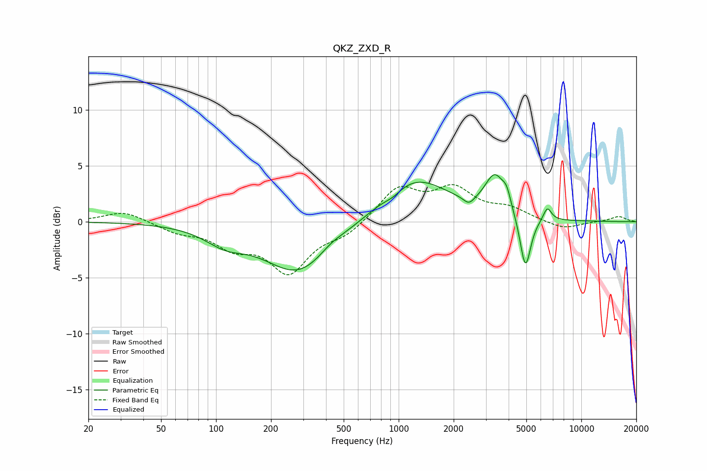

# QKZ_ZXD_R
See [usage instructions](https://github.com/jaakkopasanen/AutoEq#usage) for more options and info.

### Parametric EQs
Apply preamp of -4.3 dB when using parametric equalizer.

|   # | Type    |   Fc (Hz) |    Q |   Gain (dB) |
|-----|---------|-----------|------|-------------|
|   1 | Peaking |       112 | 1.27 |        -1.3 |
|   2 | Peaking |       286 | 0.74 |        -4.7 |
|   3 | Peaking |       426 | 1.96 |         0.6 |
|   4 | Peaking |       931 | 2.98 |        -0.5 |
|   5 | Peaking |      1214 | 0.74 |         4   |
|   6 | Peaking |      2426 | 4.83 |        -0.7 |
|   7 | Peaking |      3363 | 2.59 |         3.4 |
|   8 | Peaking |      3902 | 5.99 |         1.2 |
|   9 | Peaking |      4942 | 4.73 |        -4.9 |
|  10 | Peaking |      6515 | 6    |         1.2 |

### Fixed Band EQs
When using fixed band (also called graphic) equalizer, apply preamp of **-3.4 dB** (if available) and set gains manually with these parameters.

|   # | Type    |   Fc (Hz) |    Q |   Gain (dB) |
|-----|---------|-----------|------|-------------|
|   1 | Peaking |        31 | 1.41 |         1   |
|   2 | Peaking |        62 | 1.41 |        -0.8 |
|   3 | Peaking |       125 | 1.41 |        -1.9 |
|   4 | Peaking |       250 | 1.41 |        -4.3 |
|   5 | Peaking |       500 | 1.41 |        -1.1 |
|   6 | Peaking |      1000 | 1.41 |         2.9 |
|   7 | Peaking |      2000 | 1.41 |         2.7 |
|   8 | Peaking |      4000 | 1.41 |         1   |
|   9 | Peaking |      8000 | 1.41 |        -0.7 |
|  10 | Peaking |     16000 | 1.41 |         0.5 |

### Graphs

