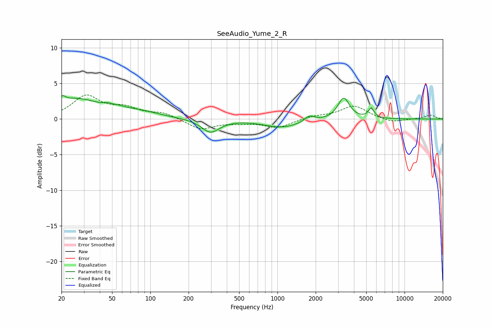

# SeeAudio_Yume_2_R
See [usage instructions](https://github.com/jaakkopasanen/AutoEq#usage) for more options and info.

### Parametric EQs
Apply preamp of -3.4 dB when using parametric equalizer.

|   # | Type    |   Fc (Hz) |    Q |   Gain (dB) |
|-----|---------|-----------|------|-------------|
|   1 | Peaking |        20 | 5.92 |         0.9 |
|   2 | Peaking |        26 | 0.79 |         2.7 |
|   3 | Peaking |        45 | 5.99 |         0.2 |
|   4 | Peaking |        53 | 1.98 |         0.5 |
|   5 | Peaking |        81 | 0.88 |         0.8 |
|   6 | Peaking |       298 | 2.01 |        -1.9 |
|   7 | Peaking |      1088 | 0.98 |        -1.2 |
|   8 | Peaking |      1787 | 3.74 |         0.8 |
|   9 | Peaking |      3319 | 3.13 |         3   |
|  10 | Peaking |      5473 | 6    |         1.3 |

### Fixed Band EQs
When using fixed band (also called graphic) equalizer, apply preamp of **-3.5 dB** (if available) and set gains manually with these parameters.

|   # | Type    |   Fc (Hz) |    Q |   Gain (dB) |
|-----|---------|-----------|------|-------------|
|   1 | Peaking |        31 | 1.41 |         3.1 |
|   2 | Peaking |        62 | 1.41 |         1.3 |
|   3 | Peaking |       125 | 1.41 |         0.8 |
|   4 | Peaking |       250 | 1.41 |        -1.5 |
|   5 | Peaking |       500 | 1.41 |        -0.4 |
|   6 | Peaking |      1000 | 1.41 |        -1.2 |
|   7 | Peaking |      2000 | 1.41 |         0.4 |
|   8 | Peaking |      4000 | 1.41 |         1.8 |
|   9 | Peaking |      8000 | 1.41 |        -0.5 |
|  10 | Peaking |     16000 | 1.41 |         0.6 |

### Graphs

