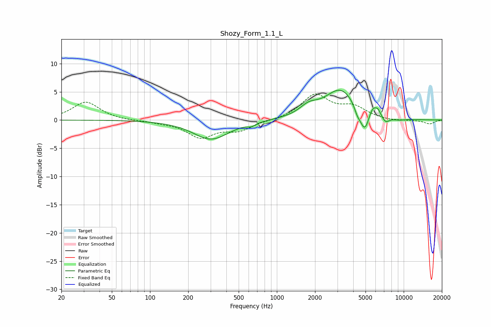

# Shozy_Form_1.1_L
See [usage instructions](https://github.com/jaakkopasanen/AutoEq#usage) for more options and info.

### Parametric EQs
Apply preamp of -5.4 dB when using parametric equalizer.

|   # | Type    |   Fc (Hz) |    Q |   Gain (dB) |
|-----|---------|-----------|------|-------------|
|   1 | Peaking |       302 | 1.01 |        -3.4 |
|   2 | Peaking |       630 | 4.88 |        -0.5 |
|   3 | Peaking |      1778 | 2    |         1.6 |
|   4 | Peaking |      3190 | 1.11 |         5.4 |
|   5 | Peaking |      4310 | 5.68 |        -1.3 |
|   6 | Peaking |      4915 | 3.84 |        -4   |
|   7 | Peaking |      5695 | 4.75 |         1.6 |
|   8 | Peaking |      6254 | 6    |         1   |
|   9 | Peaking |      7187 | 4.47 |        -1.1 |
|  10 | Peaking |      9149 | 2.27 |        -0.3 |

### Fixed Band EQs
When using fixed band (also called graphic) equalizer, apply preamp of **-4.7 dB** (if available) and set gains manually with these parameters.

|   # | Type    |   Fc (Hz) |    Q |   Gain (dB) |
|-----|---------|-----------|------|-------------|
|   1 | Peaking |        31 | 1.41 |         3.2 |
|   2 | Peaking |        62 | 1.41 |        -0.1 |
|   3 | Peaking |       125 | 1.41 |        -0.3 |
|   4 | Peaking |       250 | 1.41 |        -2.9 |
|   5 | Peaking |       500 | 1.41 |        -1.7 |
|   6 | Peaking |      1000 | 1.41 |        -0.1 |
|   7 | Peaking |      2000 | 1.41 |         4.3 |
|   8 | Peaking |      4000 | 1.41 |         2.1 |
|   9 | Peaking |      8000 | 1.41 |        -0.2 |
|  10 | Peaking |     16000 | 1.41 |        -0.7 |

### Graphs

