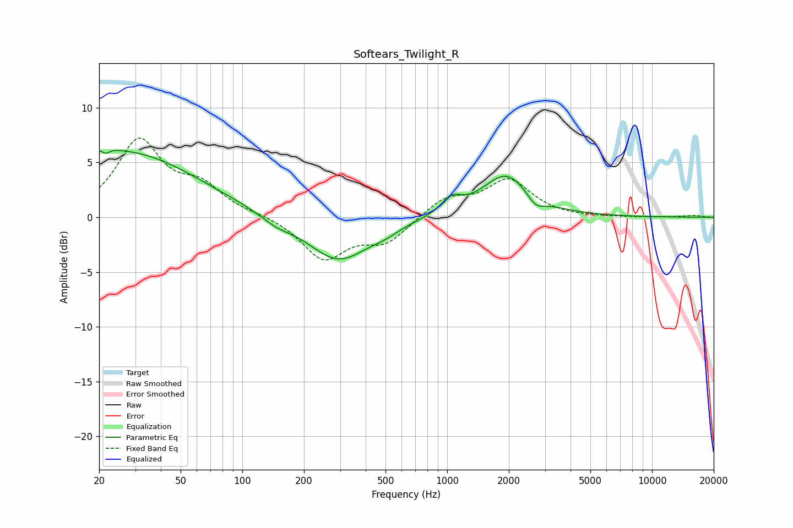

# Softears_Twilight_R
See [usage instructions](https://github.com/jaakkopasanen/AutoEq#usage) for more options and info.

### Parametric EQs
Apply preamp of -6.2 dB when using parametric equalizer.

|   # | Type    |   Fc (Hz) |    Q |   Gain (dB) |
|-----|---------|-----------|------|-------------|
|   1 | Peaking |        20 | 1.33 |         0.9 |
|   2 | Peaking |        21 | 5.45 |         3.4 |
|   3 | Peaking |        21 | 5.95 |        -3.5 |
|   4 | Peaking |        29 | 0.43 |         5.5 |
|   5 | Peaking |       146 | 1.88 |        -0.7 |
|   6 | Peaking |       295 | 0.94 |        -4   |
|   7 | Peaking |       498 | 2.25 |        -0.4 |
|   8 | Peaking |      1048 | 2.89 |         1.3 |
|   9 | Peaking |      1948 | 1.21 |         4   |
|  10 | Peaking |      2702 | 3.2  |        -1.1 |

### Fixed Band EQs
When using fixed band (also called graphic) equalizer, apply preamp of **-7.3 dB** (if available) and set gains manually with these parameters.

|   # | Type    |   Fc (Hz) |    Q |   Gain (dB) |
|-----|---------|-----------|------|-------------|
|   1 | Peaking |        31 | 1.41 |         6.8 |
|   2 | Peaking |        62 | 1.41 |         2.4 |
|   3 | Peaking |       125 | 1.41 |         0.2 |
|   4 | Peaking |       250 | 1.41 |        -3.8 |
|   5 | Peaking |       500 | 1.41 |        -2.2 |
|   6 | Peaking |      1000 | 1.41 |         1.7 |
|   7 | Peaking |      2000 | 1.41 |         3.3 |
|   8 | Peaking |      4000 | 1.41 |        -0.1 |
|   9 | Peaking |      8000 | 1.41 |        -0   |
|  10 | Peaking |     16000 | 1.41 |         0.2 |

### Graphs

