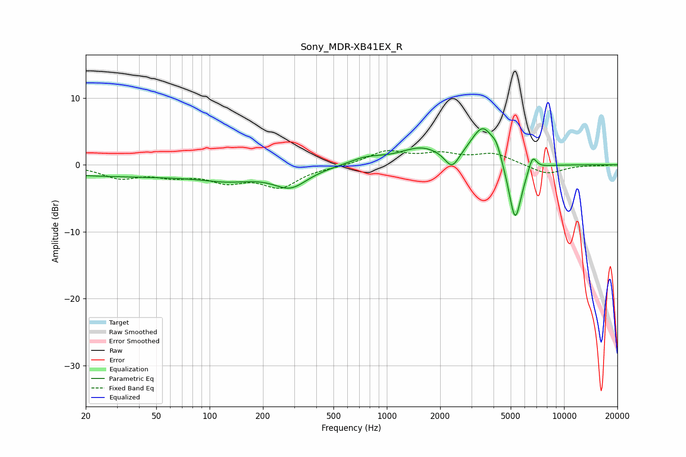

# Sony_MDR-XB41EX_R
See [usage instructions](https://github.com/jaakkopasanen/AutoEq#usage) for more options and info.

### Parametric EQs
Apply preamp of -5.5 dB when using parametric equalizer.

|   # | Type    |   Fc (Hz) |    Q |   Gain (dB) |
|-----|---------|-----------|------|-------------|
|   1 | Peaking |        43 | 0.18 |        -1.7 |
|   2 | Peaking |       127 | 1.04 |        -0.9 |
|   3 | Peaking |       286 | 1.52 |        -2.7 |
|   4 | Peaking |       762 | 1.47 |         1   |
|   5 | Peaking |      1567 | 1.14 |         2.4 |
|   6 | Peaking |      2331 | 3.59 |        -2.5 |
|   7 | Peaking |      3493 | 2.04 |         5.7 |
|   8 | Peaking |      4162 | 5.42 |         1.5 |
|   9 | Peaking |      5294 | 3.68 |        -9.4 |
|  10 | Peaking |      6637 | 5.93 |         2.3 |

### Fixed Band EQs
When using fixed band (also called graphic) equalizer, apply preamp of **-2.2 dB** (if available) and set gains manually with these parameters.

|   # | Type    |   Fc (Hz) |    Q |   Gain (dB) |
|-----|---------|-----------|------|-------------|
|   1 | Peaking |        31 | 1.41 |        -1.8 |
|   2 | Peaking |        62 | 1.41 |        -1.4 |
|   3 | Peaking |       125 | 1.41 |        -2.1 |
|   4 | Peaking |       250 | 1.41 |        -3.1 |
|   5 | Peaking |       500 | 1.41 |        -0.2 |
|   6 | Peaking |      1000 | 1.41 |         2   |
|   7 | Peaking |      2000 | 1.41 |         1.4 |
|   8 | Peaking |      4000 | 1.41 |         1.6 |
|   9 | Peaking |      8000 | 1.41 |        -1.5 |
|  10 | Peaking |     16000 | 1.41 |        -0.1 |

### Graphs

