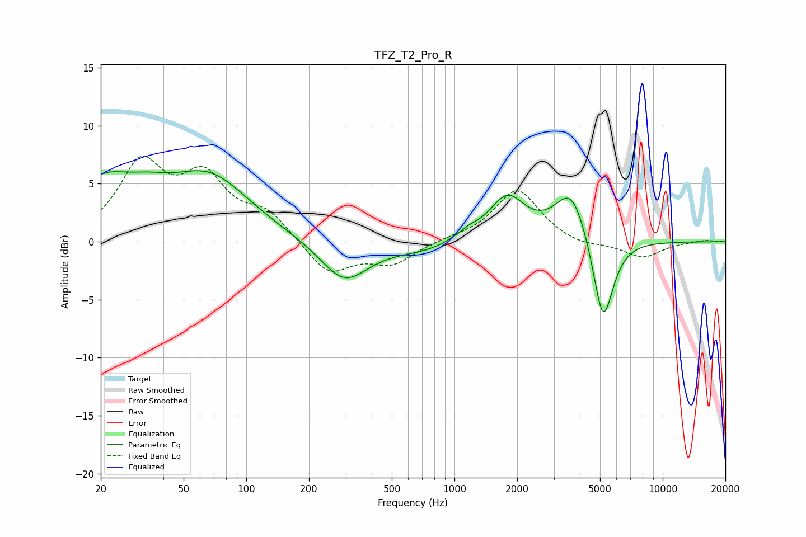

# TFZ_T2_Pro_R
See [usage instructions](https://github.com/jaakkopasanen/AutoEq#usage) for more options and info.

### Parametric EQs
Apply preamp of -6.2 dB when using parametric equalizer.

|   # | Type    |   Fc (Hz) |    Q |   Gain (dB) |
|-----|---------|-----------|------|-------------|
|   1 | Peaking |        20 | 0.96 |         4.3 |
|   2 | Peaking |        34 | 1.2  |         1.5 |
|   3 | Peaking |        67 | 0.72 |         5.3 |
|   4 | Peaking |       295 | 1.23 |        -3.5 |
|   5 | Peaking |       721 | 0.85 |        -0.8 |
|   6 | Peaking |      1073 | 5.57 |        -0.1 |
|   7 | Peaking |      1136 | 2.5  |         0.8 |
|   8 | Peaking |      1791 | 1.64 |         3.8 |
|   9 | Peaking |      3648 | 1.77 |         4.6 |
|  10 | Peaking |      5170 | 2.8  |        -7.8 |

### Fixed Band EQs
When using fixed band (also called graphic) equalizer, apply preamp of **-7.5 dB** (if available) and set gains manually with these parameters.

|   # | Type    |   Fc (Hz) |    Q |   Gain (dB) |
|-----|---------|-----------|------|-------------|
|   1 | Peaking |        31 | 1.41 |         6.4 |
|   2 | Peaking |        62 | 1.41 |         4.9 |
|   3 | Peaking |       125 | 1.41 |         2.2 |
|   4 | Peaking |       250 | 1.41 |        -2.8 |
|   5 | Peaking |       500 | 1.41 |        -1.8 |
|   6 | Peaking |      1000 | 1.41 |         0.2 |
|   7 | Peaking |      2000 | 1.41 |         4.5 |
|   8 | Peaking |      4000 | 1.41 |        -0.5 |
|   9 | Peaking |      8000 | 1.41 |        -1.4 |
|  10 | Peaking |     16000 | 1.41 |         0.2 |

### Graphs

