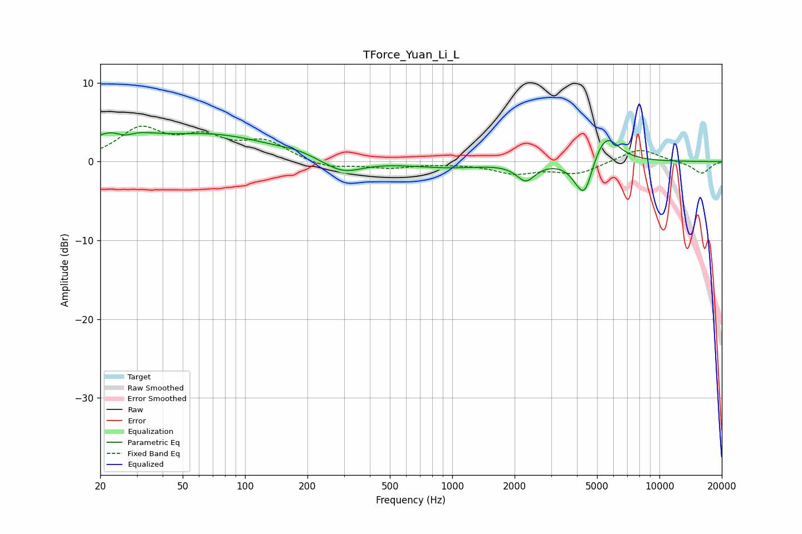

# TForce_Yuan_Li_L
See [usage instructions](https://github.com/jaakkopasanen/AutoEq#usage) for more options and info.

### Parametric EQs
Apply preamp of -3.8 dB when using parametric equalizer.

|   # | Type    |   Fc (Hz) |    Q |   Gain (dB) |
|-----|---------|-----------|------|-------------|
|   1 | Peaking |        24 | 1.14 |         3.4 |
|   2 | Peaking |        26 | 2.89 |        -1.3 |
|   3 | Peaking |        71 | 0.49 |         3.2 |
|   4 | Peaking |       178 | 1.82 |         0.4 |
|   5 | Peaking |       296 | 1.5  |        -1.7 |
|   6 | Peaking |       942 | 0.79 |        -0.7 |
|   7 | Peaking |      2265 | 3.18 |        -2.2 |
|   8 | Peaking |      4029 | 3.17 |        -1.4 |
|   9 | Peaking |      4377 | 3.83 |        -3.9 |
|  10 | Peaking |      5509 | 2.23 |         3.7 |

### Fixed Band EQs
When using fixed band (also called graphic) equalizer, apply preamp of **-4.6 dB** (if available) and set gains manually with these parameters.

|   # | Type    |   Fc (Hz) |    Q |   Gain (dB) |
|-----|---------|-----------|------|-------------|
|   1 | Peaking |        31 | 1.41 |         3.9 |
|   2 | Peaking |        62 | 1.41 |         2.6 |
|   3 | Peaking |       125 | 1.41 |         2.4 |
|   4 | Peaking |       250 | 1.41 |        -0.9 |
|   5 | Peaking |       500 | 1.41 |        -0.7 |
|   6 | Peaking |      1000 | 1.41 |        -0.1 |
|   7 | Peaking |      2000 | 1.41 |        -1.4 |
|   8 | Peaking |      4000 | 1.41 |        -1.5 |
|   9 | Peaking |      8000 | 1.41 |         1.7 |
|  10 | Peaking |     16000 | 1.41 |        -1.5 |

### Graphs

