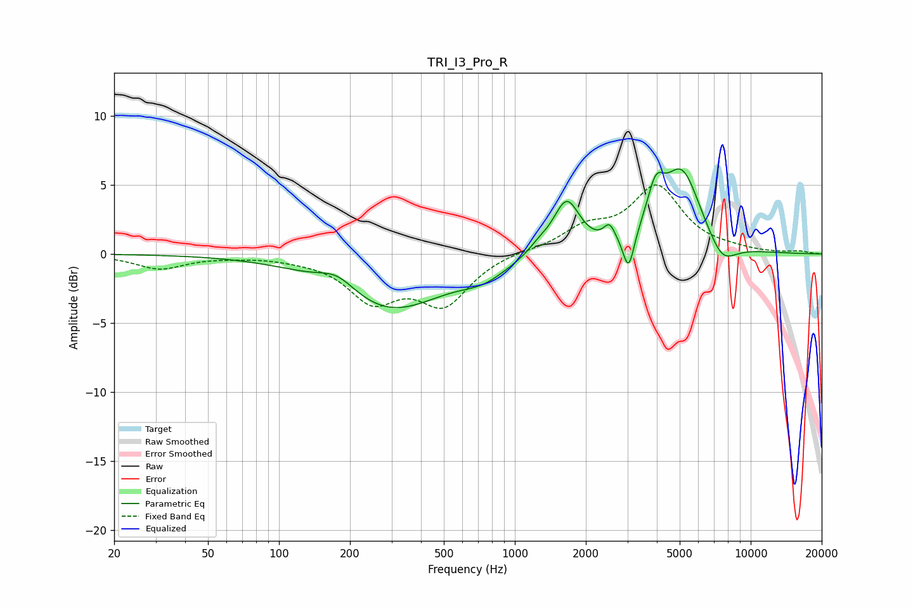

# TRI_I3_Pro_R
See [usage instructions](https://github.com/jaakkopasanen/AutoEq#usage) for more options and info.

### Parametric EQs
Apply preamp of -6.3 dB when using parametric equalizer.

|   # | Type    |   Fc (Hz) |    Q |   Gain (dB) |
|-----|---------|-----------|------|-------------|
|   1 | Peaking |       177 | 1.75 |         1.2 |
|   2 | Peaking |       293 | 0.61 |        -4.1 |
|   3 | Peaking |       736 | 1.47 |        -0.9 |
|   4 | Peaking |      1264 | 3.02 |         0.6 |
|   5 | Peaking |      1657 | 2.52 |         3.8 |
|   6 | Peaking |      2520 | 5.85 |         1.2 |
|   7 | Peaking |      3037 | 5.99 |        -2.8 |
|   8 | Peaking |      3951 | 3.88 |         2.8 |
|   9 | Peaking |      5104 | 1.69 |         5.9 |
|  10 | Peaking |      7559 | 2.22 |        -1.8 |

### Fixed Band EQs
When using fixed band (also called graphic) equalizer, apply preamp of **-5.1 dB** (if available) and set gains manually with these parameters.

|   # | Type    |   Fc (Hz) |    Q |   Gain (dB) |
|-----|---------|-----------|------|-------------|
|   1 | Peaking |        31 | 1.41 |        -1   |
|   2 | Peaking |        62 | 1.41 |        -0.1 |
|   3 | Peaking |       125 | 1.41 |        -0.2 |
|   4 | Peaking |       250 | 1.41 |        -3.1 |
|   5 | Peaking |       500 | 1.41 |        -3.5 |
|   6 | Peaking |      1000 | 1.41 |         0.2 |
|   7 | Peaking |      2000 | 1.41 |         1.6 |
|   8 | Peaking |      4000 | 1.41 |         4.7 |
|   9 | Peaking |      8000 | 1.41 |         0.2 |
|  10 | Peaking |     16000 | 1.41 |         0.2 |

### Graphs

