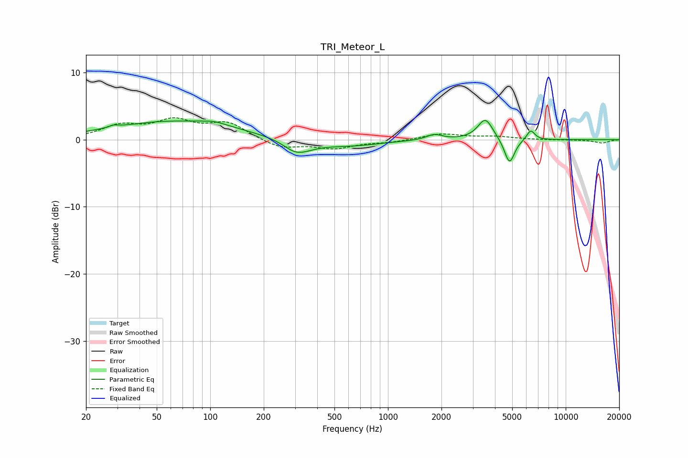

# TRI_Meteor_L
See [usage instructions](https://github.com/jaakkopasanen/AutoEq#usage) for more options and info.

### Parametric EQs
Apply preamp of -3.0 dB when using parametric equalizer.

|   # | Type    |   Fc (Hz) |    Q |   Gain (dB) |
|-----|---------|-----------|------|-------------|
|   1 | Peaking |        29 | 5.44 |         0.3 |
|   2 | Peaking |        64 | 0.39 |         2.8 |
|   3 | Peaking |       105 | 2.16 |         0.5 |
|   4 | Peaking |       263 | 1.77 |         0.7 |
|   5 | Peaking |       299 | 1.6  |        -2.7 |
|   6 | Peaking |       607 | 0.79 |        -0.9 |
|   7 | Peaking |      1822 | 3.21 |         0.8 |
|   8 | Peaking |      3532 | 3.32 |         3.2 |
|   9 | Peaking |      4829 | 4.85 |        -3.8 |
|  10 | Peaking |      6355 | 5.99 |         1.5 |

### Fixed Band EQs
When using fixed band (also called graphic) equalizer, apply preamp of **-3.4 dB** (if available) and set gains manually with these parameters.

|   # | Type    |   Fc (Hz) |    Q |   Gain (dB) |
|-----|---------|-----------|------|-------------|
|   1 | Peaking |        31 | 1.41 |         1.9 |
|   2 | Peaking |        62 | 1.41 |         2.5 |
|   3 | Peaking |       125 | 1.41 |         2.4 |
|   4 | Peaking |       250 | 1.41 |        -1.3 |
|   5 | Peaking |       500 | 1.41 |        -1.2 |
|   6 | Peaking |      1000 | 1.41 |        -0.3 |
|   7 | Peaking |      2000 | 1.41 |         0.9 |
|   8 | Peaking |      4000 | 1.41 |         0.4 |
|   9 | Peaking |      8000 | 1.41 |        -0   |
|  10 | Peaking |     16000 | 1.41 |        -0.5 |

### Graphs

