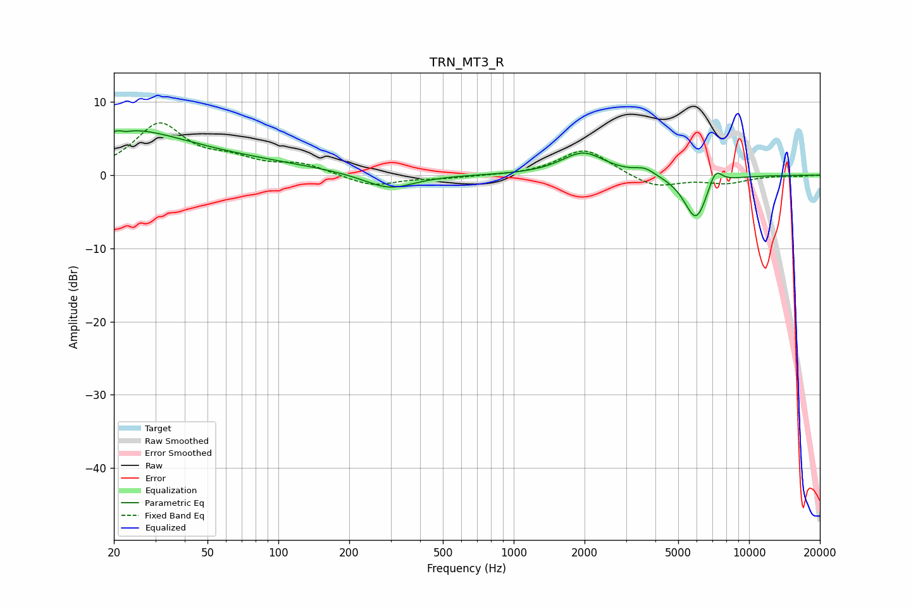

# TRN_MT3_R
See [usage instructions](https://github.com/jaakkopasanen/AutoEq#usage) for more options and info.

### Parametric EQs
Apply preamp of -6.2 dB when using parametric equalizer.

|   # | Type    |   Fc (Hz) |    Q |   Gain (dB) |
|-----|---------|-----------|------|-------------|
|   1 | Peaking |        22 | 5.87 |         3.2 |
|   2 | Peaking |        22 | 0.59 |         5   |
|   3 | Peaking |        22 | 5.88 |        -3.3 |
|   4 | Peaking |        56 | 0.37 |         1.7 |
|   5 | Peaking |       296 | 1.32 |        -2.1 |
|   6 | Peaking |      1972 | 1.54 |         3.1 |
|   7 | Peaking |      3545 | 5.09 |        -0.2 |
|   8 | Peaking |      3596 | 3.5  |         1.1 |
|   9 | Peaking |      5951 | 2.71 |        -6.3 |
|  10 | Peaking |      7184 | 4.56 |         2.6 |

### Fixed Band EQs
When using fixed band (also called graphic) equalizer, apply preamp of **-7.2 dB** (if available) and set gains manually with these parameters.

|   # | Type    |   Fc (Hz) |    Q |   Gain (dB) |
|-----|---------|-----------|------|-------------|
|   1 | Peaking |        31 | 1.41 |         6.8 |
|   2 | Peaking |        62 | 1.41 |         1.6 |
|   3 | Peaking |       125 | 1.41 |         1.4 |
|   4 | Peaking |       250 | 1.41 |        -1.6 |
|   5 | Peaking |       500 | 1.41 |        -0.4 |
|   6 | Peaking |      1000 | 1.41 |        -0.1 |
|   7 | Peaking |      2000 | 1.41 |         3.7 |
|   8 | Peaking |      4000 | 1.41 |        -1.8 |
|   9 | Peaking |      8000 | 1.41 |        -1   |
|  10 | Peaking |     16000 | 1.41 |        -0.1 |

### Graphs

