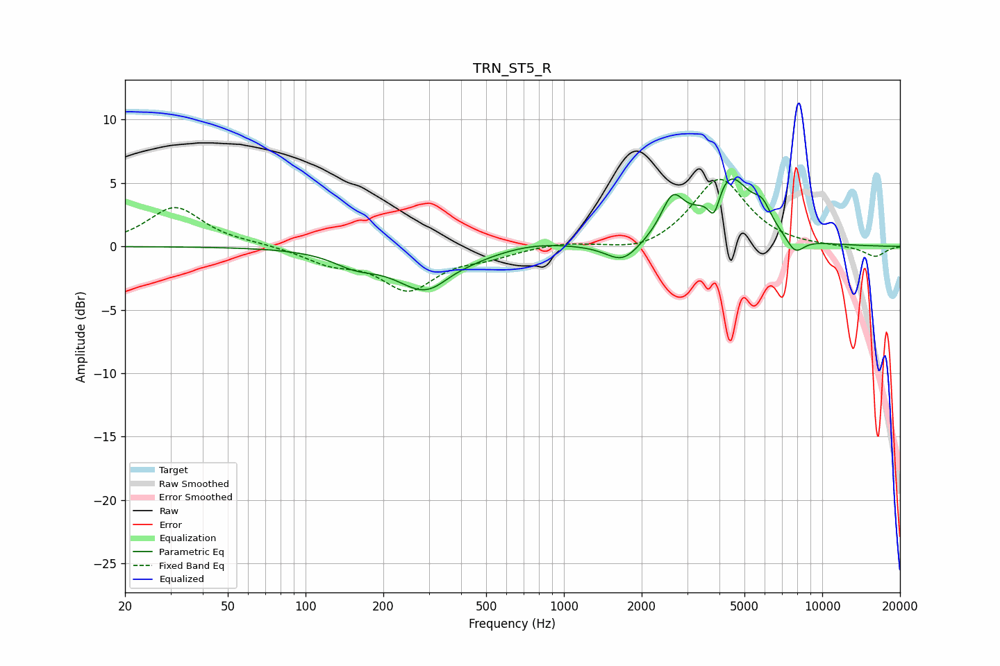

# TRN_ST5_R
See [usage instructions](https://github.com/jaakkopasanen/AutoEq#usage) for more options and info.

### Parametric EQs
Apply preamp of -5.4 dB when using parametric equalizer.

|   # | Type    |   Fc (Hz) |    Q |   Gain (dB) |
|-----|---------|-----------|------|-------------|
|   1 | Peaking |       155 | 1.65 |        -1   |
|   2 | Peaking |       298 | 1.18 |        -3.6 |
|   3 | Peaking |       361 | 2.11 |         0.5 |
|   4 | Peaking |       773 | 1.05 |         0.4 |
|   5 | Peaking |      1689 | 2.19 |        -1.6 |
|   6 | Peaking |      2634 | 3.21 |         3   |
|   7 | Peaking |      3816 | 5.93 |        -2.3 |
|   8 | Peaking |      4338 | 1.59 |         5.5 |
|   9 | Peaking |      5864 | 4.05 |         1.4 |
|  10 | Peaking |      7852 | 3.65 |        -1.3 |

### Fixed Band EQs
When using fixed band (also called graphic) equalizer, apply preamp of **-5.4 dB** (if available) and set gains manually with these parameters.

|   # | Type    |   Fc (Hz) |    Q |   Gain (dB) |
|-----|---------|-----------|------|-------------|
|   1 | Peaking |        31 | 1.41 |         3.1 |
|   2 | Peaking |        62 | 1.41 |         0.2 |
|   3 | Peaking |       125 | 1.41 |        -1.1 |
|   4 | Peaking |       250 | 1.41 |        -3.2 |
|   5 | Peaking |       500 | 1.41 |        -0.7 |
|   6 | Peaking |      1000 | 1.41 |         0.3 |
|   7 | Peaking |      2000 | 1.41 |        -0.6 |
|   8 | Peaking |      4000 | 1.41 |         5.4 |
|   9 | Peaking |      8000 | 1.41 |        -0   |
|  10 | Peaking |     16000 | 1.41 |        -0.8 |

### Graphs

