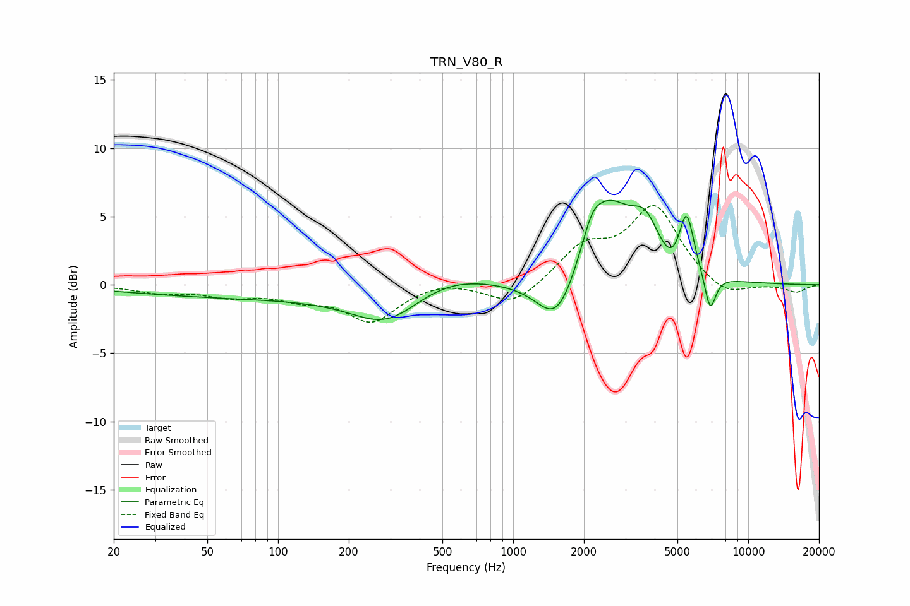

# TRN_V80_R
See [usage instructions](https://github.com/jaakkopasanen/AutoEq#usage) for more options and info.

### Parametric EQs
Apply preamp of -6.3 dB when using parametric equalizer.

|   # | Type    |   Fc (Hz) |    Q |   Gain (dB) |
|-----|---------|-----------|------|-------------|
|   1 | Peaking |       115 | 0.19 |        -1   |
|   2 | Peaking |       291 | 0.98 |        -2.3 |
|   3 | Peaking |       517 | 0.77 |         1.3 |
|   4 | Peaking |      1547 | 1.6  |        -4.2 |
|   5 | Peaking |      2158 | 3.54 |         1.4 |
|   6 | Peaking |      2505 | 1.24 |         6   |
|   7 | Peaking |      3653 | 2.33 |         2.8 |
|   8 | Peaking |      4709 | 3    |        -1   |
|   9 | Peaking |      5468 | 4.39 |         4.4 |
|  10 | Peaking |      6887 | 5.66 |        -2.8 |

### Fixed Band EQs
When using fixed band (also called graphic) equalizer, apply preamp of **-5.9 dB** (if available) and set gains manually with these parameters.

|   # | Type    |   Fc (Hz) |    Q |   Gain (dB) |
|-----|---------|-----------|------|-------------|
|   1 | Peaking |        31 | 1.41 |        -0.5 |
|   2 | Peaking |        62 | 1.41 |        -0.7 |
|   3 | Peaking |       125 | 1.41 |        -0.8 |
|   4 | Peaking |       250 | 1.41 |        -2.6 |
|   5 | Peaking |       500 | 1.41 |         0.4 |
|   6 | Peaking |      1000 | 1.41 |        -1.6 |
|   7 | Peaking |      2000 | 1.41 |         2.5 |
|   8 | Peaking |      4000 | 1.41 |         5.6 |
|   9 | Peaking |      8000 | 1.41 |        -1.1 |
|  10 | Peaking |     16000 | 1.41 |        -0.6 |

### Graphs

