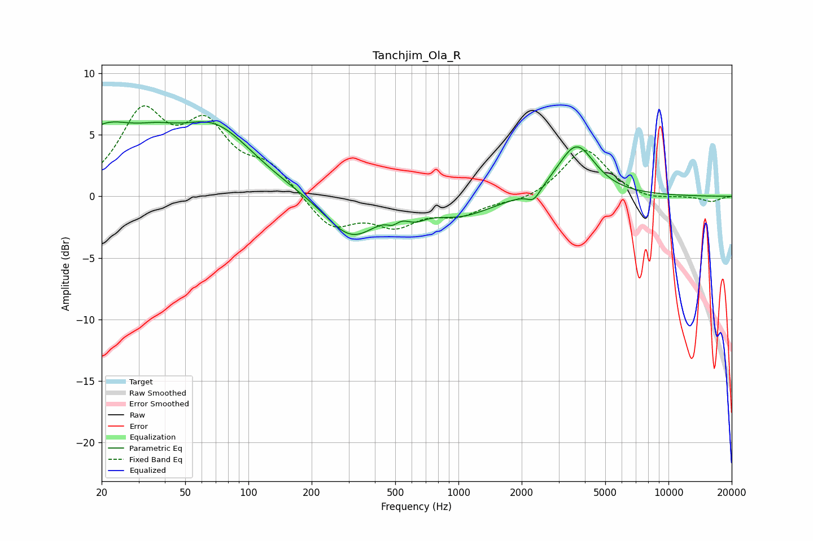

# Tanchjim_Ola_R
See [usage instructions](https://github.com/jaakkopasanen/AutoEq#usage) for more options and info.

### Parametric EQs
Apply preamp of -6.2 dB when using parametric equalizer.

|   # | Type    |   Fc (Hz) |    Q |   Gain (dB) |
|-----|---------|-----------|------|-------------|
|   1 | Peaking |        20 | 0.87 |         4.7 |
|   2 | Peaking |        37 | 1.28 |         1.4 |
|   3 | Peaking |        69 | 0.75 |         5.1 |
|   4 | Peaking |       308 | 1.14 |        -3.4 |
|   5 | Peaking |       486 | 5.04 |        -0.6 |
|   6 | Peaking |       548 | 1.66 |         0.5 |
|   7 | Peaking |       616 | 2.72 |        -0.9 |
|   8 | Peaking |      1017 | 0.9  |        -1.5 |
|   9 | Peaking |      2284 | 4.38 |        -0.9 |
|  10 | Peaking |      3643 | 1.6  |         4.2 |

### Fixed Band EQs
When using fixed band (also called graphic) equalizer, apply preamp of **-7.5 dB** (if available) and set gains manually with these parameters.

|   # | Type    |   Fc (Hz) |    Q |   Gain (dB) |
|-----|---------|-----------|------|-------------|
|   1 | Peaking |        31 | 1.41 |         6.3 |
|   2 | Peaking |        62 | 1.41 |         5.1 |
|   3 | Peaking |       125 | 1.41 |         2.2 |
|   4 | Peaking |       250 | 1.41 |        -2.6 |
|   5 | Peaking |       500 | 1.41 |        -2.1 |
|   6 | Peaking |      1000 | 1.41 |        -1.3 |
|   7 | Peaking |      2000 | 1.41 |        -0.5 |
|   8 | Peaking |      4000 | 1.41 |         3.9 |
|   9 | Peaking |      8000 | 1.41 |        -0.4 |
|  10 | Peaking |     16000 | 1.41 |        -0.4 |

### Graphs

