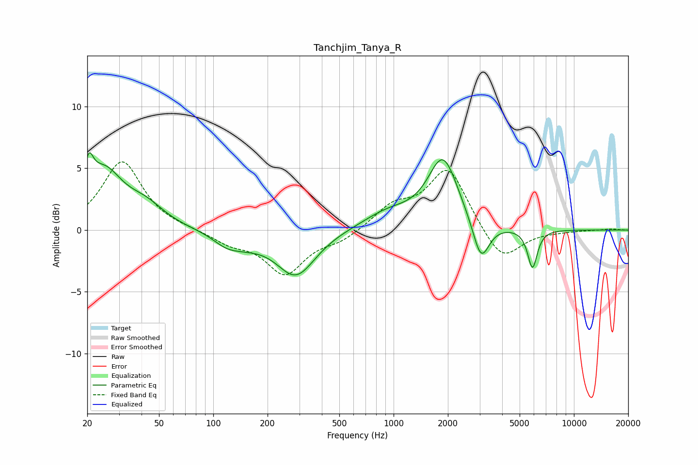

# Tanchjim_Tanya_R
See [usage instructions](https://github.com/jaakkopasanen/AutoEq#usage) for more options and info.

### Parametric EQs
Apply preamp of -6.3 dB when using parametric equalizer.

|   # | Type    |   Fc (Hz) |    Q |   Gain (dB) |
|-----|---------|-----------|------|-------------|
|   1 | Peaking |        20 | 5.89 |         2.4 |
|   2 | Peaking |        25 | 1.35 |         4.5 |
|   3 | Peaking |        42 | 1.36 |         1.5 |
|   4 | Peaking |       118 | 1.85 |        -0.8 |
|   5 | Peaking |       150 | 1.39 |        -0.7 |
|   6 | Peaking |       287 | 1.3  |        -3.7 |
|   7 | Peaking |       931 | 1    |         1.3 |
|   8 | Peaking |      1880 | 1.69 |         5.6 |
|   9 | Peaking |      3053 | 3.12 |        -3.3 |
|  10 | Peaking |      5891 | 5.24 |        -3.1 |

### Fixed Band EQs
When using fixed band (also called graphic) equalizer, apply preamp of **-5.6 dB** (if available) and set gains manually with these parameters.

|   # | Type    |   Fc (Hz) |    Q |   Gain (dB) |
|-----|---------|-----------|------|-------------|
|   1 | Peaking |        31 | 1.41 |         5.6 |
|   2 | Peaking |        62 | 1.41 |         0.1 |
|   3 | Peaking |       125 | 1.41 |        -1   |
|   4 | Peaking |       250 | 1.41 |        -3.5 |
|   5 | Peaking |       500 | 1.41 |        -0.8 |
|   6 | Peaking |      1000 | 1.41 |         1.8 |
|   7 | Peaking |      2000 | 1.41 |         5   |
|   8 | Peaking |      4000 | 1.41 |        -2.7 |
|   9 | Peaking |      8000 | 1.41 |        -0.1 |
|  10 | Peaking |     16000 | 1.41 |         0.1 |

### Graphs

