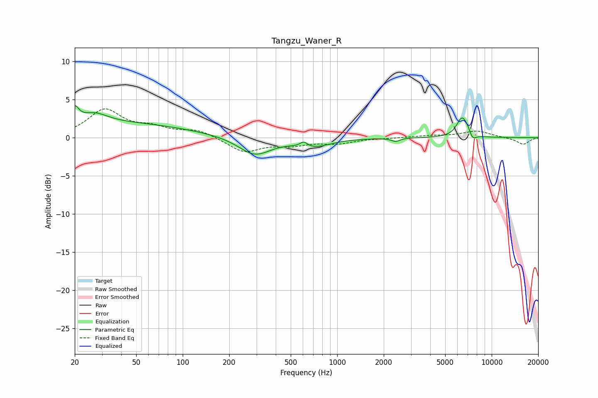

# Tangzu_Waner_R
See [usage instructions](https://github.com/jaakkopasanen/AutoEq#usage) for more options and info.

### Parametric EQs
Apply preamp of -4.3 dB when using parametric equalizer.

|   # | Type    |   Fc (Hz) |    Q |   Gain (dB) |
|-----|---------|-----------|------|-------------|
|   1 | Peaking |        20 | 5.91 |         1.6 |
|   2 | Peaking |        26 | 0.21 |         2   |
|   3 | Peaking |        27 | 1.74 |         1.1 |
|   4 | Peaking |       292 | 1.36 |        -2.3 |
|   5 | Peaking |       607 | 5.96 |         0.7 |
|   6 | Peaking |       699 | 1.27 |        -1.1 |
|   7 | Peaking |      2390 | 5.37 |        -0.4 |
|   8 | Peaking |      6427 | 3.96 |         2.6 |
|   9 | Peaking |      7055 | 6    |         0.6 |
|  10 | Peaking |      7468 | 5.45 |        -1.1 |

### Fixed Band EQs
When using fixed band (also called graphic) equalizer, apply preamp of **-3.9 dB** (if available) and set gains manually with these parameters.

|   # | Type    |   Fc (Hz) |    Q |   Gain (dB) |
|-----|---------|-----------|------|-------------|
|   1 | Peaking |        31 | 1.41 |         3.5 |
|   2 | Peaking |        62 | 1.41 |         1.1 |
|   3 | Peaking |       125 | 1.41 |         1   |
|   4 | Peaking |       250 | 1.41 |        -1.9 |
|   5 | Peaking |       500 | 1.41 |        -0.8 |
|   6 | Peaking |      1000 | 1.41 |        -0.7 |
|   7 | Peaking |      2000 | 1.41 |        -0.1 |
|   8 | Peaking |      4000 | 1.41 |         0.2 |
|   9 | Peaking |      8000 | 1.41 |         0.9 |
|  10 | Peaking |     16000 | 1.41 |        -0.9 |

### Graphs

