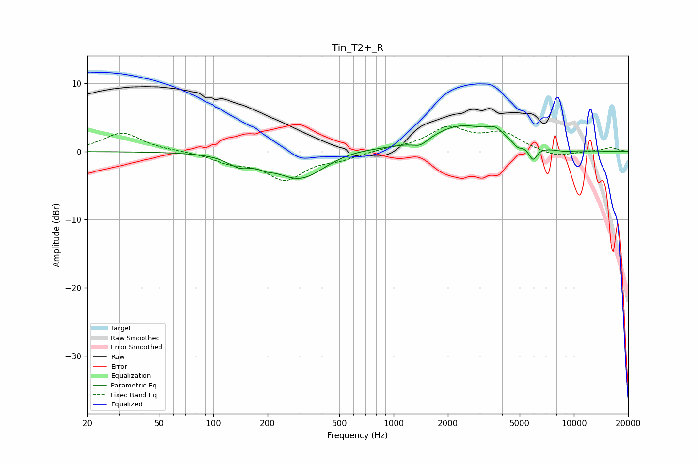

# Tin_T2+_R
See [usage instructions](https://github.com/jaakkopasanen/AutoEq#usage) for more options and info.

### Parametric EQs
Apply preamp of -3.9 dB when using parametric equalizer.

|   # | Type    |   Fc (Hz) |    Q |   Gain (dB) |
|-----|---------|-----------|------|-------------|
|   1 | Peaking |       140 | 2.21 |        -1.4 |
|   2 | Peaking |       196 | 4.16 |        -0.4 |
|   3 | Peaking |       304 | 1    |        -4.2 |
|   4 | Peaking |       555 | 0.85 |         0.7 |
|   5 | Peaking |      1407 | 3.24 |        -1   |
|   6 | Peaking |      2372 | 0.82 |         3.7 |
|   7 | Peaking |      3668 | 3.14 |         1.3 |
|   8 | Peaking |      4879 | 6    |        -0.7 |
|   9 | Peaking |      5927 | 6    |        -2   |
|  10 | Peaking |      8827 | 2.47 |        -0.3 |

### Fixed Band EQs
When using fixed band (also called graphic) equalizer, apply preamp of **-3.8 dB** (if available) and set gains manually with these parameters.

|   # | Type    |   Fc (Hz) |    Q |   Gain (dB) |
|-----|---------|-----------|------|-------------|
|   1 | Peaking |        31 | 1.41 |         2.7 |
|   2 | Peaking |        62 | 1.41 |         0.1 |
|   3 | Peaking |       125 | 1.41 |        -1.4 |
|   4 | Peaking |       250 | 1.41 |        -3.9 |
|   5 | Peaking |       500 | 1.41 |        -0.9 |
|   6 | Peaking |      1000 | 1.41 |         0.4 |
|   7 | Peaking |      2000 | 1.41 |         3.3 |
|   8 | Peaking |      4000 | 1.41 |         2.5 |
|   9 | Peaking |      8000 | 1.41 |        -0.9 |
|  10 | Peaking |     16000 | 1.41 |         0.6 |

### Graphs

