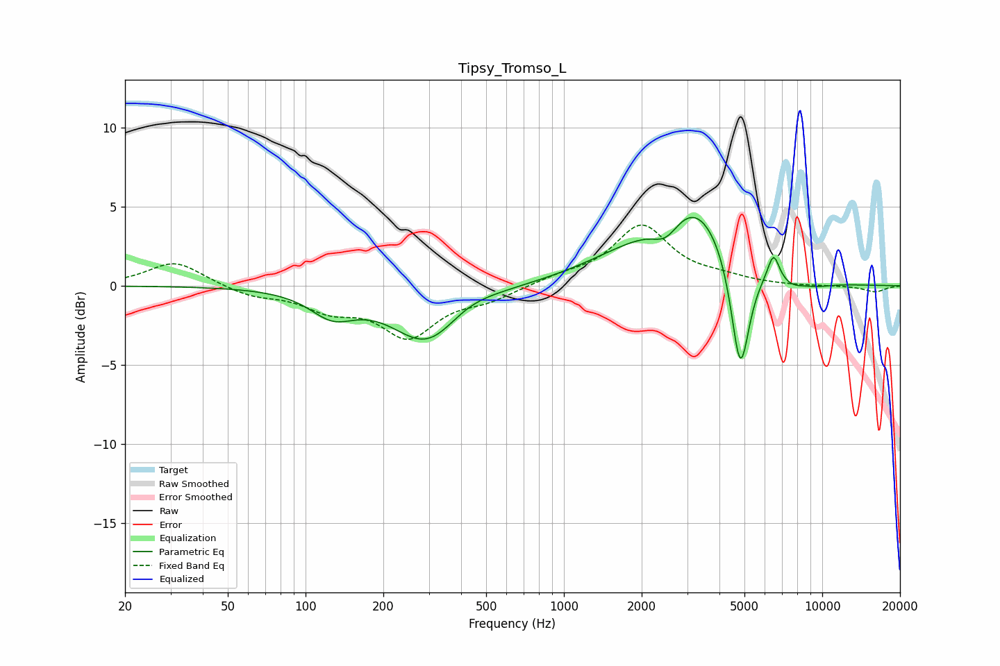

# Tipsy_Tromso_L
See [usage instructions](https://github.com/jaakkopasanen/AutoEq#usage) for more options and info.

### Parametric EQs
Apply preamp of -4.4 dB when using parametric equalizer.

|   # | Type    |   Fc (Hz) |    Q |   Gain (dB) |
|-----|---------|-----------|------|-------------|
|   1 | Peaking |       127 | 1.62 |        -1.6 |
|   2 | Peaking |       297 | 1.05 |        -3.7 |
|   3 | Peaking |       418 | 1.39 |         0.7 |
|   4 | Peaking |      1812 | 0.72 |         1.4 |
|   5 | Peaking |      2487 | 2.67 |        -1.3 |
|   6 | Peaking |      3234 | 1    |         4.6 |
|   7 | Peaking |      4817 | 3.84 |        -7.5 |
|   8 | Peaking |      6479 | 5.99 |         1.8 |
|   9 | Peaking |      7569 | 2.52 |        -0.5 |
|  10 | Peaking |      9454 | 1.83 |        -0.3 |

### Fixed Band EQs
When using fixed band (also called graphic) equalizer, apply preamp of **-3.9 dB** (if available) and set gains manually with these parameters.

|   # | Type    |   Fc (Hz) |    Q |   Gain (dB) |
|-----|---------|-----------|------|-------------|
|   1 | Peaking |        31 | 1.41 |         1.6 |
|   2 | Peaking |        62 | 1.41 |        -0.6 |
|   3 | Peaking |       125 | 1.41 |        -1.3 |
|   4 | Peaking |       250 | 1.41 |        -3.1 |
|   5 | Peaking |       500 | 1.41 |        -0.8 |
|   6 | Peaking |      1000 | 1.41 |         0.5 |
|   7 | Peaking |      2000 | 1.41 |         3.7 |
|   8 | Peaking |      4000 | 1.41 |         0.4 |
|   9 | Peaking |      8000 | 1.41 |        -0   |
|  10 | Peaking |     16000 | 1.41 |        -0.4 |

### Graphs

