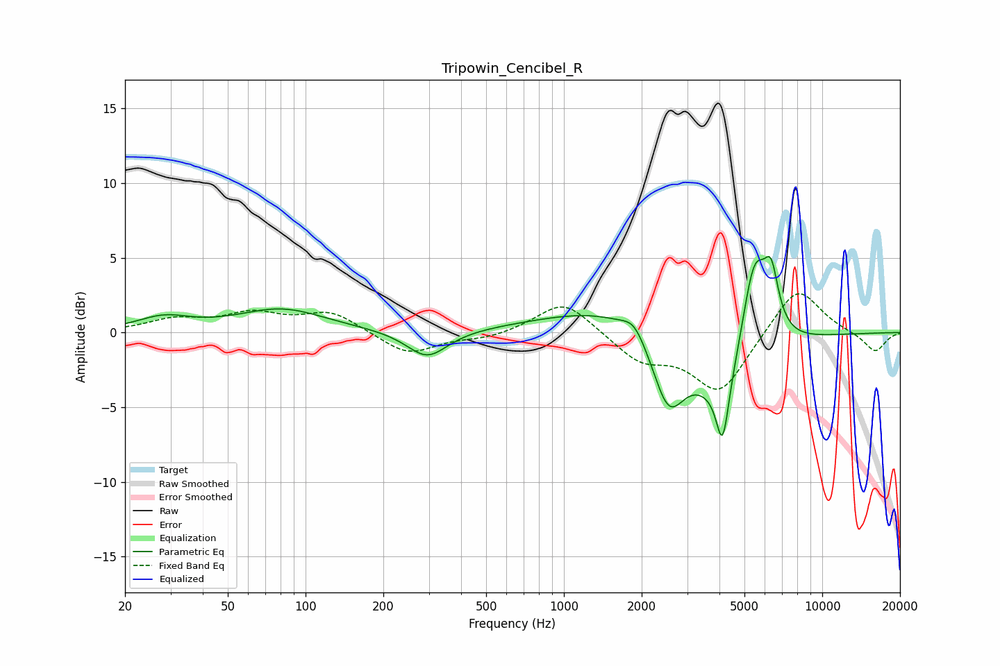

# Tripowin_Cencibel_R
See [usage instructions](https://github.com/jaakkopasanen/AutoEq#usage) for more options and info.

### Parametric EQs
Apply preamp of -5.2 dB when using parametric equalizer.

|   # | Type    |   Fc (Hz) |    Q |   Gain (dB) |
|-----|---------|-----------|------|-------------|
|   1 | Peaking |        28 | 1.4  |         0.9 |
|   2 | Peaking |        81 | 0.84 |         1.5 |
|   3 | Peaking |       296 | 1.79 |        -1.9 |
|   4 | Peaking |      1710 | 0.49 |         2   |
|   5 | Peaking |      1871 | 3.35 |         1   |
|   6 | Peaking |      2537 | 2.23 |        -4.7 |
|   7 | Peaking |      4115 | 5.92 |        -4.1 |
|   8 | Peaking |      4247 | 1.04 |        -5.5 |
|   9 | Peaking |      5449 | 2.54 |         7.6 |
|  10 | Peaking |      6352 | 4.95 |         3.4 |

### Fixed Band EQs
When using fixed band (also called graphic) equalizer, apply preamp of **-2.7 dB** (if available) and set gains manually with these parameters.

|   # | Type    |   Fc (Hz) |    Q |   Gain (dB) |
|-----|---------|-----------|------|-------------|
|   1 | Peaking |        31 | 1.41 |         0.8 |
|   2 | Peaking |        62 | 1.41 |         1.1 |
|   3 | Peaking |       125 | 1.41 |         1.3 |
|   4 | Peaking |       250 | 1.41 |        -1.5 |
|   5 | Peaking |       500 | 1.41 |        -0.4 |
|   6 | Peaking |      1000 | 1.41 |         2.2 |
|   7 | Peaking |      2000 | 1.41 |        -1.8 |
|   8 | Peaking |      4000 | 1.41 |        -4   |
|   9 | Peaking |      8000 | 1.41 |         3.3 |
|  10 | Peaking |     16000 | 1.41 |        -1.3 |

### Graphs

