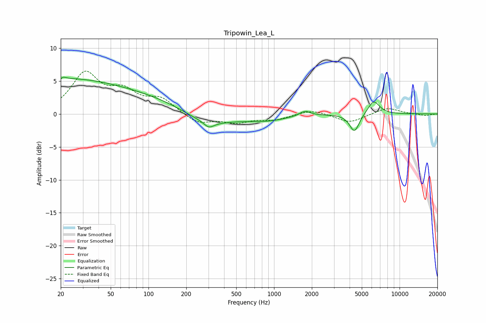

# Tripowin_Lea_L
See [usage instructions](https://github.com/jaakkopasanen/AutoEq#usage) for more options and info.

### Parametric EQs
Apply preamp of -5.7 dB when using parametric equalizer.

|   # | Type    |   Fc (Hz) |    Q |   Gain (dB) |
|-----|---------|-----------|------|-------------|
|   1 | Peaking |        20 | 0.26 |         5.2 |
|   2 | Peaking |        20 | 5.98 |        -3.2 |
|   3 | Peaking |        20 | 5.94 |         3.2 |
|   4 | Peaking |       142 | 0.45 |         1.6 |
|   5 | Peaking |       284 | 0.68 |        -2.3 |
|   6 | Peaking |       303 | 3.64 |        -0.9 |
|   7 | Peaking |       867 | 0.83 |        -0.8 |
|   8 | Peaking |      1763 | 3.3  |         0.8 |
|   9 | Peaking |      4370 | 3.62 |        -2.8 |
|  10 | Peaking |      6217 | 2.94 |         2.1 |

### Fixed Band EQs
When using fixed band (also called graphic) equalizer, apply preamp of **-6.6 dB** (if available) and set gains manually with these parameters.

|   # | Type    |   Fc (Hz) |    Q |   Gain (dB) |
|-----|---------|-----------|------|-------------|
|   1 | Peaking |        31 | 1.41 |         5.9 |
|   2 | Peaking |        62 | 1.41 |         2.9 |
|   3 | Peaking |       125 | 1.41 |         2.1 |
|   4 | Peaking |       250 | 1.41 |        -1.5 |
|   5 | Peaking |       500 | 1.41 |        -1.2 |
|   6 | Peaking |      1000 | 1.41 |        -0.8 |
|   7 | Peaking |      2000 | 1.41 |         0.7 |
|   8 | Peaking |      4000 | 1.41 |        -1.3 |
|   9 | Peaking |      8000 | 1.41 |         1   |
|  10 | Peaking |     16000 | 1.41 |        -0.3 |

### Graphs

