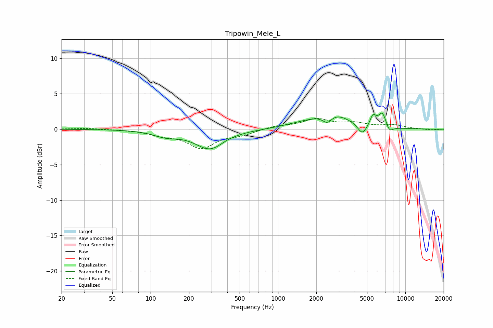

# Tripowin_Mele_L
See [usage instructions](https://github.com/jaakkopasanen/AutoEq#usage) for more options and info.

### Parametric EQs
Apply preamp of -2.4 dB when using parametric equalizer.

|   # | Type    |   Fc (Hz) |    Q |   Gain (dB) |
|-----|---------|-----------|------|-------------|
|   1 | Peaking |       132 | 1.42 |        -0.8 |
|   2 | Peaking |       294 | 1.21 |        -2.8 |
|   3 | Peaking |       389 | 2.02 |         0.2 |
|   4 | Peaking |      1577 | 0.93 |         0.6 |
|   5 | Peaking |      2436 | 3.81 |        -1.2 |
|   6 | Peaking |      2711 | 1.08 |         2   |
|   7 | Peaking |      4589 | 3.88 |        -1.5 |
|   8 | Peaking |      5571 | 5.99 |         1.5 |
|   9 | Peaking |      6617 | 4.19 |         2.2 |
|  10 | Peaking |      7446 | 4.43 |        -1.1 |

### Fixed Band EQs
When using fixed band (also called graphic) equalizer, apply preamp of **-1.6 dB** (if available) and set gains manually with these parameters.

|   # | Type    |   Fc (Hz) |    Q |   Gain (dB) |
|-----|---------|-----------|------|-------------|
|   1 | Peaking |        31 | 1.41 |         0.2 |
|   2 | Peaking |        62 | 1.41 |        -0   |
|   3 | Peaking |       125 | 1.41 |        -0.7 |
|   4 | Peaking |       250 | 1.41 |        -2.5 |
|   5 | Peaking |       500 | 1.41 |        -0.7 |
|   6 | Peaking |      1000 | 1.41 |         0.4 |
|   7 | Peaking |      2000 | 1.41 |         1.4 |
|   8 | Peaking |      4000 | 1.41 |         0.7 |
|   9 | Peaking |      8000 | 1.41 |         0.5 |
|  10 | Peaking |     16000 | 1.41 |        -0.1 |

### Graphs

