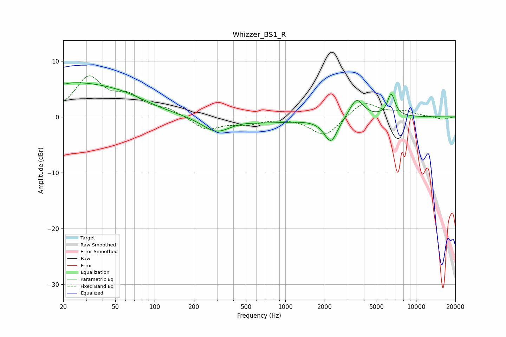

# Whizzer_BS1_R
See [usage instructions](https://github.com/jaakkopasanen/AutoEq#usage) for more options and info.

### Parametric EQs
Apply preamp of -6.2 dB when using parametric equalizer.

|   # | Type    |   Fc (Hz) |    Q |   Gain (dB) |
|-----|---------|-----------|------|-------------|
|   1 | Peaking |        20 | 5.71 |         3.4 |
|   2 | Peaking |        20 | 5.91 |        -3.4 |
|   3 | Peaking |        23 | 0.38 |         5.8 |
|   4 | Peaking |        60 | 0.78 |         1.1 |
|   5 | Peaking |       295 | 1.32 |        -2.6 |
|   6 | Peaking |       467 | 1.54 |         0.2 |
|   7 | Peaking |       748 | 0.54 |        -0.9 |
|   8 | Peaking |      2233 | 2.76 |        -4.4 |
|   9 | Peaking |      3500 | 2.68 |         3.5 |
|  10 | Peaking |      6459 | 4.7  |         3.9 |

### Fixed Band EQs
When using fixed band (also called graphic) equalizer, apply preamp of **-7.4 dB** (if available) and set gains manually with these parameters.

|   # | Type    |   Fc (Hz) |    Q |   Gain (dB) |
|-----|---------|-----------|------|-------------|
|   1 | Peaking |        31 | 1.41 |         6.8 |
|   2 | Peaking |        62 | 1.41 |         3.1 |
|   3 | Peaking |       125 | 1.41 |         1.2 |
|   4 | Peaking |       250 | 1.41 |        -2.3 |
|   5 | Peaking |       500 | 1.41 |        -1.1 |
|   6 | Peaking |      1000 | 1.41 |         0   |
|   7 | Peaking |      2000 | 1.41 |        -3.5 |
|   8 | Peaking |      4000 | 1.41 |         2.8 |
|   9 | Peaking |      8000 | 1.41 |         0.9 |
|  10 | Peaking |     16000 | 1.41 |        -0.5 |

### Graphs

