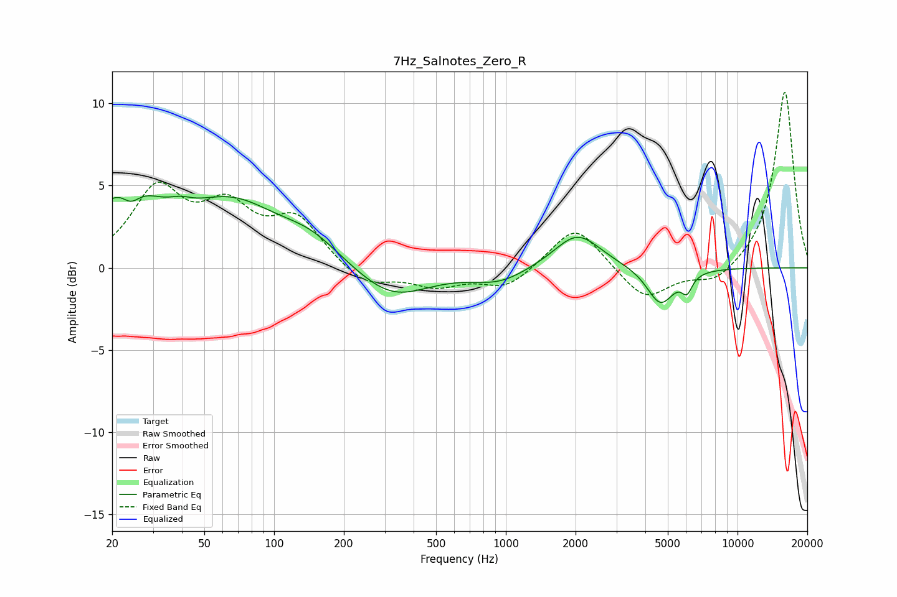

# 7Hz_Salnotes_Zero_R
See [usage instructions](https://github.com/jaakkopasanen/AutoEq#usage) for more options and info.

### Parametric EQs
Apply preamp of -4.5 dB when using parametric equalizer.

|   # | Type    |   Fc (Hz) |    Q |   Gain (dB) |
|-----|---------|-----------|------|-------------|
|   1 | Peaking |        23 | 1.06 |         4.3 |
|   2 | Peaking |        24 | 3.34 |        -1.2 |
|   3 | Peaking |        39 | 2.93 |         0.4 |
|   4 | Peaking |        66 | 0.7  |         3.5 |
|   5 | Peaking |       144 | 1.05 |         1.3 |
|   6 | Peaking |       322 | 0.89 |        -2   |
|   7 | Peaking |       938 | 1.2  |        -0.8 |
|   8 | Peaking |      2036 | 1.41 |         2.2 |
|   9 | Peaking |      4650 | 2.4  |        -2.3 |
|  10 | Peaking |      6051 | 6    |        -1   |

### Fixed Band EQs
When using fixed band (also called graphic) equalizer, apply preamp of **-10.8 dB** (if available) and set gains manually with these parameters.

|   # | Type    |   Fc (Hz) |    Q |   Gain (dB) |
|-----|---------|-----------|------|-------------|
|   1 | Peaking |        31 | 1.41 |         4.5 |
|   2 | Peaking |        62 | 1.41 |         3.2 |
|   3 | Peaking |       125 | 1.41 |         2.8 |
|   4 | Peaking |       250 | 1.41 |        -1.2 |
|   5 | Peaking |       500 | 1.41 |        -1   |
|   6 | Peaking |      1000 | 1.41 |        -1.2 |
|   7 | Peaking |      2000 | 1.41 |         2.7 |
|   8 | Peaking |      4000 | 1.41 |        -2   |
|   9 | Peaking |      8000 | 1.41 |        -1   |
|  10 | Peaking |     16000 | 1.41 |        10.8 |

### Graphs

