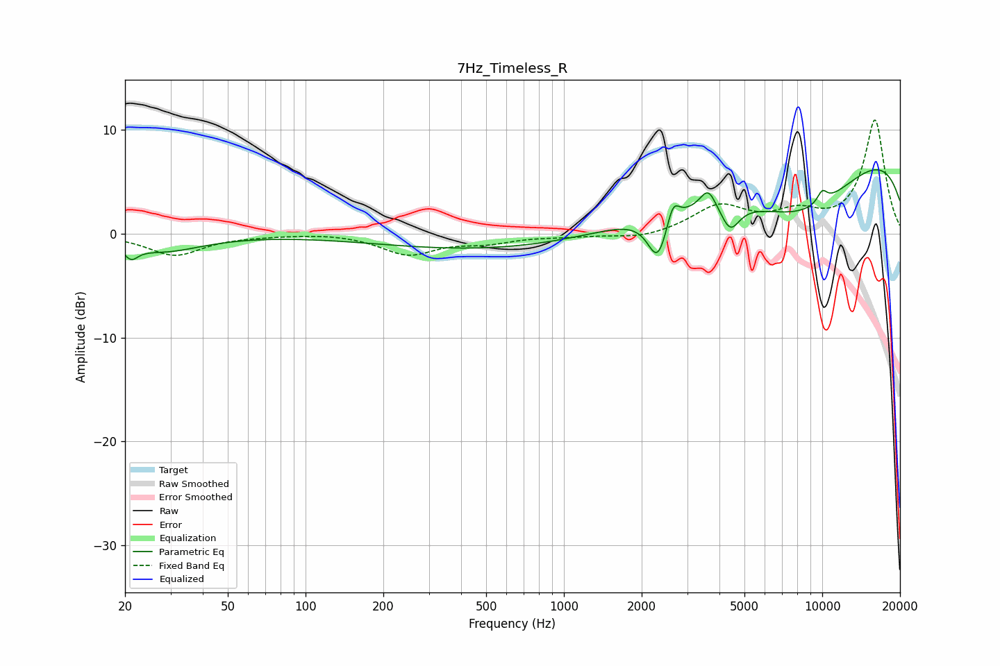

# 7Hz_Timeless_R
See [usage instructions](https://github.com/jaakkopasanen/AutoEq#usage) for more options and info.

### Parametric EQs
Apply preamp of -6.2 dB when using parametric equalizer.

|   # | Type    |   Fc (Hz) |    Q |   Gain (dB) |
|-----|---------|-----------|------|-------------|
|   1 | Peaking |        21 | 5.36 |        -1.2 |
|   2 | Peaking |        28 | 0.93 |        -1.6 |
|   3 | Peaking |      1014 | 0.18 |        -1.9 |
|   4 | Peaking |      2311 | 3.66 |        -4.4 |
|   5 | Peaking |      2643 | 5.98 |         2.2 |
|   6 | Peaking |      3616 | 4.63 |         2   |
|   7 | Peaking |      4404 | 3.89 |        -2.5 |
|   8 | Peaking |      8375 | 0.51 |        -7.4 |
|   9 | Peaking |     10000 | 0.19 |        10.3 |
|  10 | Peaking |     10000 | 6    |         1.2 |

### Fixed Band EQs
When using fixed band (also called graphic) equalizer, apply preamp of **-11.0 dB** (if available) and set gains manually with these parameters.

|   # | Type    |   Fc (Hz) |    Q |   Gain (dB) |
|-----|---------|-----------|------|-------------|
|   1 | Peaking |        31 | 1.41 |        -2.1 |
|   2 | Peaking |        62 | 1.41 |        -0.1 |
|   3 | Peaking |       125 | 1.41 |         0.1 |
|   4 | Peaking |       250 | 1.41 |        -1.9 |
|   5 | Peaking |       500 | 1.41 |        -0.7 |
|   6 | Peaking |      1000 | 1.41 |        -0.2 |
|   7 | Peaking |      2000 | 1.41 |        -0.5 |
|   8 | Peaking |      4000 | 1.41 |         2.6 |
|   9 | Peaking |      8000 | 1.41 |         1.7 |
|  10 | Peaking |     16000 | 1.41 |        10.9 |

### Graphs

