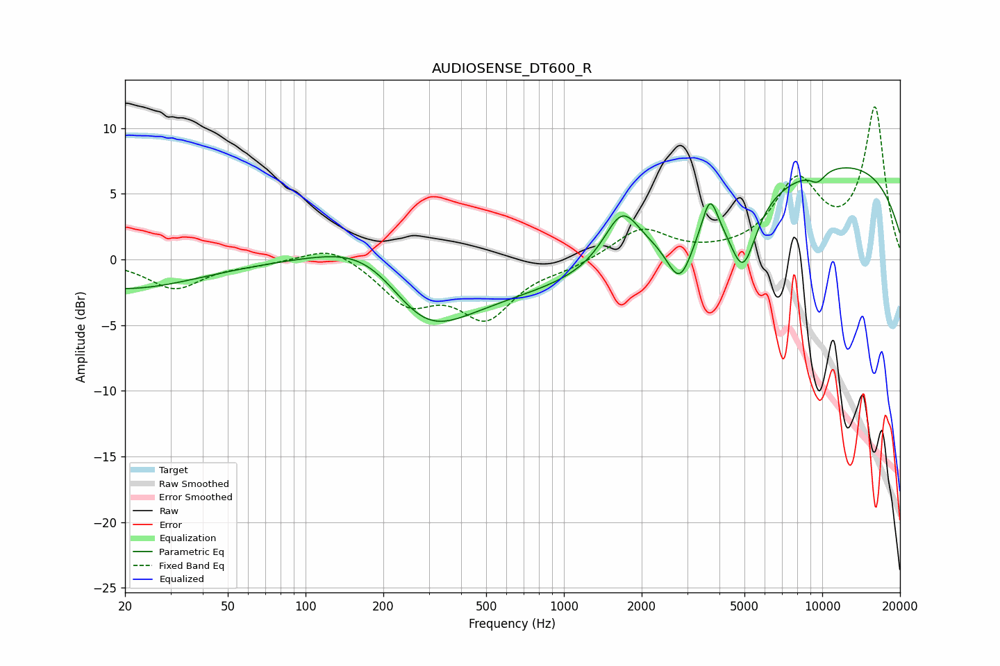

# AUDIOSENSE_DT600_R
See [usage instructions](https://github.com/jaakkopasanen/AutoEq#usage) for more options and info.

### Parametric EQs
Apply preamp of -7.1 dB when using parametric equalizer.

|   # | Type    |   Fc (Hz) |    Q |   Gain (dB) |
|-----|---------|-----------|------|-------------|
|   1 | Peaking |        20 | 0.5  |        -2.2 |
|   2 | Peaking |       187 | 0.74 |         3.7 |
|   3 | Peaking |       283 | 0.8  |        -5.7 |
|   4 | Peaking |      1601 | 0.18 |        -2.7 |
|   5 | Peaking |      1676 | 2.05 |         3.9 |
|   6 | Peaking |      2810 | 2.79 |        -3.8 |
|   7 | Peaking |      3676 | 4.7  |         2.9 |
|   8 | Peaking |      4936 | 2.69 |        -5.1 |
|   9 | Peaking |      9475 | 0.22 |         8   |
|  10 | Peaking |      9591 | 4.1  |        -0.8 |

### Fixed Band EQs
When using fixed band (also called graphic) equalizer, apply preamp of **-11.7 dB** (if available) and set gains manually with these parameters.

|   # | Type    |   Fc (Hz) |    Q |   Gain (dB) |
|-----|---------|-----------|------|-------------|
|   1 | Peaking |        31 | 1.41 |        -2.2 |
|   2 | Peaking |        62 | 1.41 |        -0.3 |
|   3 | Peaking |       125 | 1.41 |         1.3 |
|   4 | Peaking |       250 | 1.41 |        -3.1 |
|   5 | Peaking |       500 | 1.41 |        -4.2 |
|   6 | Peaking |      1000 | 1.41 |        -0.5 |
|   7 | Peaking |      2000 | 1.41 |         2.3 |
|   8 | Peaking |      4000 | 1.41 |         0.1 |
|   9 | Peaking |      8000 | 1.41 |         5.6 |
|  10 | Peaking |     16000 | 1.41 |        11.4 |

### Graphs

